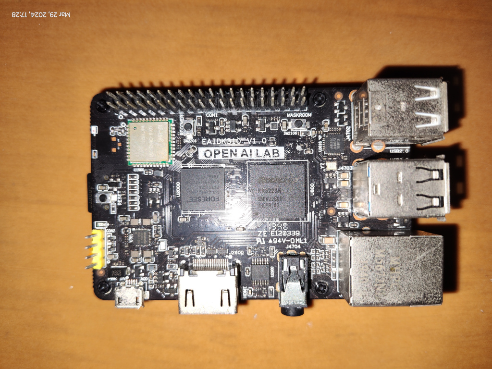
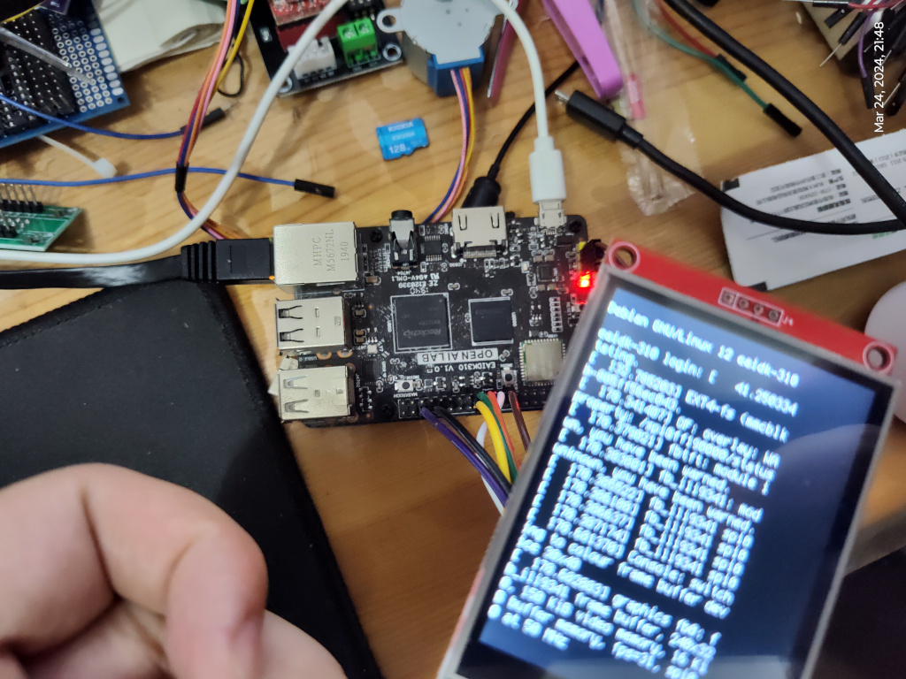
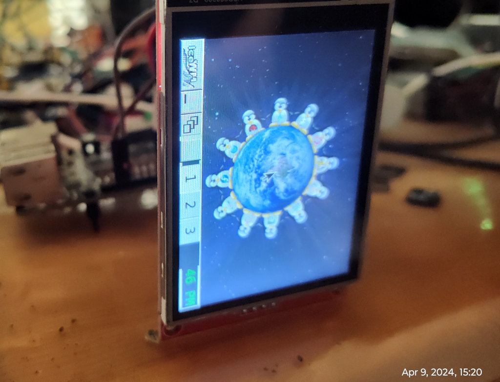
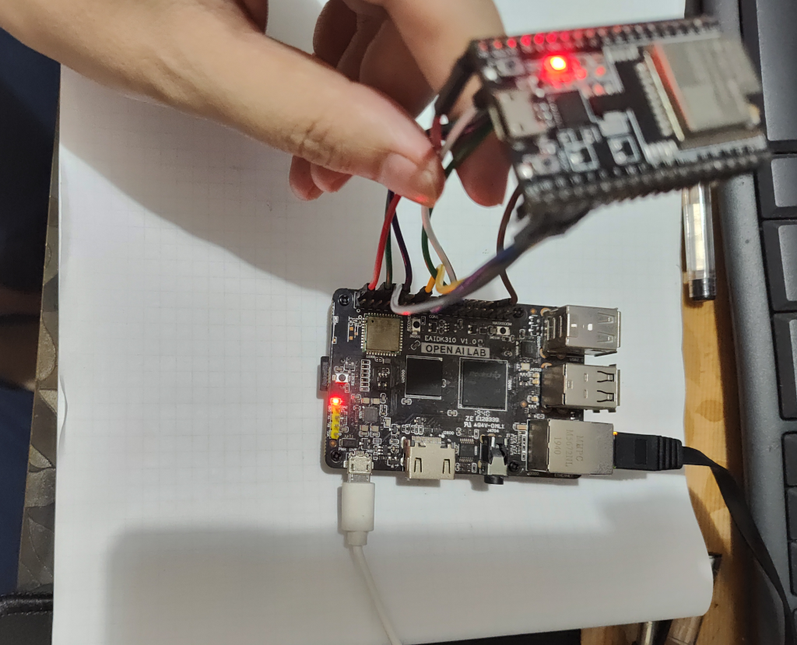

# EAIDK-310 SBC board
## Product Introduction
  * EAIDK 310: Arm cpu and ARM MaLI GPU ,Main chip uses the RK3228H of mainstream performance Arm Soc.
  * CPU: ARM 4 core Cortex-A53 ,64 bit processor
  * RAM:LPDDR3 1GB
  * Wifi :2.4G/5GHz,Bluetooth 5.0
  * Power:Micro USB 5v/2A HDMI:2.0, 1*Type -A
  * Operation system :Linux and Android 8.1,
  * Video code API :Hard decoding and hardcode

What works:
  - Mainline u-boot. (have detect sdio problem).
  - Mainline stable kernel, latest stable version on build date.
  - Mainline ATF provided as Trusted Execution Environment.
  - All 4 cores are working.
  - Ethernet
  - Wifi+BT (with old u-boot)
  - fbdev with ILI9341 SPI
  - sdmmc_ext SDIO with [esp-hosted](https://github.com/espressif/esp-hosted), tested with `ESP32`.

Releases:
  * Kernel 6.8.9, The latest stable version of the day.
  * U-boot v2024.07-rc1
  * Debian 12(bookworm)
  * default user: eaidk , password: 1234

## Test `ILI9341`

* lcd with eaidk connect table.

|  RK3328 CON1  | 2.8 inch SPI |
| :-----------: | :----------: |
| GPIO3_A0 (23) |     SCK      |
| GPIO3_A1 (19) |  SDI(MOSI)   |
| GPIO3_A2 (21) |  SDO(MISO)   |
| GPIO2_C4 (36) |      DC      |
| GPIO3_B0 (24) |      CS      |
| GPIO2_B7 (7)  |    RESET     |
|  VCC 3v3 (1)  |      BK      |
|  VCC 3v3 (17) |     VCC      |
|      GND (6)  |     GND      |


* device tree overlay plugin patch

```sh
/dts-v1/;
/plugin/;

#include <dt-bindings/gpio/gpio.h>
#include <dt-bindings/pinctrl/rockchip.h>
#include <dt-bindings/interrupt-controller/irq.h>

/{
    fragment@0 {
        target= <&spi0>;
        __overlay__ {
                /delete-property/ flash@0;
                status = "okay";
                #address-cells = <1>;
			          #size-cells = <0>;
                ili9341@0 {
                    compatible = "ilitek,ili9341", "spidev";
                    reg = <0>;
                    spi-max-frequency = <50000000>;
                    rotate = <0>;
                    bgr;
                    fps = <30>;
                    buswidth = <8>;
                    reset-gpios = <&gpio2 RK_PB7 GPIO_ACTIVE_LOW>;
                    dc-gpios = <&gpio2 RK_PC4 GPIO_ACTIVE_HIGH>;
                    debug = <0>;
            };
        };
    };
};
```
* if load above success , will show below in dmesg

```sh
[   66.204021] fbtft: module is from the staging directory, the quality is unknown, you have been warned.
[   66.208716] fb_ili9341: module is from the staging directory, the quality is unknown, you have been warned.
[   66.210464] fb_ili9341 spi0.0: fbtft_property_value: buswidth = 8
[   66.211049] fb_ili9341 spi0.0: fbtft_property_value: debug = 0
[   66.211576] fb_ili9341 spi0.0: fbtft_property_value: rotate = 270
[   66.212128] fb_ili9341 spi0.0: fbtft_property_value: fps = 30
[   66.507261] Console: switching to colour frame buffer device 40x30
[   66.508754] graphics fb0: fb_ili9341 frame buffer, 320x240, 150 KiB video memory, 16 KiB buffer memory, fps=31, spi0.0 at 50 MHz

```
* Now you can output `rgb565` bmp files  to LCD for display.

```sh
~ # tail --bytes 153600 /home/eaidk/ffmpeg_rgb565.bmp > /dev/fb0
```

* images






### Xorg with IceWM and x11vnc

```sh
~$ sudo apt-get install icewm xinit xserver-xorg-video-fbdev x11vnc
```

* create a `/etc/X11/xorg.conf`.

```sh
~# cat /etc/X11/xorg.conf
Section "Monitor"
    Identifier          "Monitor0"
EndSection
Section "Device"
         Option     "ShadowFB"              "false"
         Option     "Rotate"                "CW"
         Option     "fbdev"                 "/dev/fb0"
         Option     "debug"                 "true"
         Identifier  "Card0"
         Driver      "fbdev"
EndSection
Section "Screen"
    Identifier          "Screen0"
    Device              "Card0"
    Monitor             "Monitor0"
    DefaultDepth        16
EndSection

```
* run `startx`

```sh
~$ startx /usr/bin/icewm-session
```
* run `x11vnc`

```sh
~$ VNC_PASSWORD=123456 x11vnc -many  -display :2
```



## ESP-Hosted test

* [ESP-Hosted](https://github.com/espressif/esp-hosted) is an open source solution that provides a way to use Espressif SoCs and modules as a communication co-processor. This solution provides wireless connectivity (Wi-Fi and BT/BLE) to the host microprocessor or microcontroller, allowing it to communicate with other devices.

* `ESP32-WROOM-32U` with `EAIDK-310` connect table.

|  eaidk-310  |     ESP32      | Function    |
| :---------: | :------------: |:-----------:|
| GPIO3_A7 22 | IO13 (pull_up) | D3          |
| GPIO3_A6 10 | IO12 (pull_up) | D2          |
| GPIO3_A5 16 | IO4  (pull_up) | D1          |
| GPIO3_A4 8  | IO2  (pull_up) | D0          |
| GPIO3_A2 21 |      IO14      | CLK         |
| GPIO3_A0 23 | IO15 (pull_up) | CMD         |
| GPIO2_C4 36 |       EN       | ESP32 Reset |
|  GND    6   |      GND       | ESP32       |
|  5V     4   |       5V       | ESP32       |


* 

* insmod first

```sh
root@eaidk-310:~# insmod ./esp32_sdio.ko resetpin=84
root@eaidk-310:~# dmesg | grep "esp32"
[  275.846457] esp32_sdio: loading out-of-tree module taints kernel.
[  275.849309] esp32_sdio: esp_reset: Triggering ESP reset.
[  276.057114] esp32_sdio: probe of mmc3:0001:1 failed with error -110
[ 1155.841868] esp32_sdio: esp_reset: Triggering ESP reset.
[ 1156.049720] esp32_sdio: probe of mmc3:0001:1 failed with error -110

```

* manual trigger mmc3

```sh
root@eaidk-310:~# echo ff5f0000.mmc > /sys/bus/platform/drivers/dwmmc_rockchip/unbind
root@eaidk-310:~# echo ff5f0000.mmc > /sys/bus/platform/drivers/dwmmc_rockchip/bind
```

* detected esp32 network adapter device by SDIO.

```sh
[ 1242.548630] mmc3: card 0001 removed
[ 1246.419890] dwmmc_rockchip ff5f0000.mmc: IDMAC supports 32-bit address mode.
[ 1246.420761] dwmmc_rockchip ff5f0000.mmc: Using internal DMA controller.
[ 1246.421396] dwmmc_rockchip ff5f0000.mmc: Version ID is 270a
[ 1246.421994] dwmmc_rockchip ff5f0000.mmc: DW MMC controller at irq 47,32 bit host data width,256 deep fifo
[ 1246.423516] mmc_host mmc3: card is non-removable.
[ 1246.437457] mmc_host mmc3: Bus speed (slot 0) = 400000Hz (slot req 400000Hz, actual 400000HZ div = 0)
[ 1246.477417] mmc3: queuing unknown CIS tuple 0x01 [d9 01 ff] (3 bytes)
[ 1246.486079] mmc3: queuing unknown CIS tuple 0x1a [01 01 00 02 07] (5 bytes)
[ 1246.490666] mmc3: queuing unknown CIS tuple 0x1b [c1 41 30 30 ff ff ff ff] (8 bytes)
[ 1246.491829] mmc_host mmc3: Bus speed (slot 0) = 25000000Hz (slot req 25000000Hz, actual 25000000HZ div = 0)
[ 1246.497985] mmc3: new SDIO card at address 0001
[ 1246.499304] esp32_sdio: esp_probe: ESP network device detected
[ 1246.500177] esp32_sdio: get_firmware_data: Rx Pre ====== 0
[ 1246.500851] esp32_sdio: get_firmware_data: Rx Pos ======  0
[ 1246.501484] esp32_sdio: get_firmware_data: Tx Pre ======  0
[ 1246.502018] esp32_sdio: get_firmware_data: Tx Pos ======  10
[ 1246.502978] esp32_sdio: esp_probe: ESP SDIO probe completed
[ 1246.556452] esp32_sdio: process_esp_bootup_event: Received ESP bootup event
[ 1246.557134] esp32_sdio: process_event_esp_bootup: Bootup Event tag: 3
[ 1246.557727] esp32_sdio: esp_validate_chipset: Chipset=ESP32 ID=00 detected over SDIO
[ 1246.558421] esp32_sdio: process_event_esp_bootup: Bootup Event tag: 0
[ 1246.558999] esp32_sdio: process_event_esp_bootup: Bootup Event tag: 1
[ 1246.559576] esp32_sdio: process_fw_data: ESP chipset\'s last reset cause:
[ 1246.560176] esp32_sdio: print_reset_reason: POWERON_RESET
[ 1246.560744] esp32_sdio: check_esp_version: ESP Firmware version: 1.0.3
[ 1246.562185] esp32_sdio: esp_reg_notifier: Driver init is ongoing
[ 1246.626914] esp32_sdio: esp_cfg80211_get_tx_power:
[ 1246.832511] esp32_sdio: init_bt: ESP Bluetooth init
[ 1246.834178] esp32_sdio: print_capabilities: Capabilities: 0x1d. Features supported are:
[ 1246.835002] esp32_sdio: print_capabilities: 	 * WLAN on SDIO
[ 1246.835557] esp32_sdio: print_capabilities: 	 * BT/BLE
[ 1246.836055] esp32_sdio: print_capabilities: 	   - HCI over SDIO
[ 1246.836837] esp32_sdio: print_capabilities: 	   - BT/BLE dual mode
[ 1247.316894] Bluetooth: MGMT ver 1.22
[ 1247.337968] NET: Registered PF_ALG protocol family

root@eaidk-310:~# ifconfig espsta0
espsta0: flags=4163<UP,BROADCAST,RUNNING,MULTICAST>  mtu 1500
        inet6 fe80::c5a8:a34c:9347:296c  prefixlen 64  scopeid 0x20<link>
        ether 78:21:84:9c:16:a0  txqueuelen 1000  (Ethernet)
        RX packets 0  bytes 0 (0.0 B)
        RX errors 0  dropped 0  overruns 0  frame 0
        TX packets 0  bytes 0 (0.0 B)
        TX errors 0  dropped 11 overruns 0  carrier 0  collisions 0

```

* Use `wpa_supplicant` to test

```sh
~$ wpa_supplicant -B -D wext -i espsta0 -c <(wpa_passphrase YOUR_SSID YOUR_WIFI_PWD)
Successfully initialized wpa_supplicant
ioctl[SIOCSIWENCODEEXT]: Invalid argument
ioctl[SIOCSIWENCODEEXT]: Invalid argument
```

## Benchmarks

* CPU info

```sh
~$ lscpu
Architecture:             aarch64
  CPU op-mode(s):         32-bit, 64-bit
  Byte Order:             Little Endian
CPU(s):                   4
  On-line CPU(s) list:    0-3
Vendor ID:                ARM
  Model name:             Cortex-A53
    Model:                4
    Thread(s) per core:   1
    Core(s) per cluster:  4
    Socket(s):            -
    Cluster(s):           1
    Stepping:             r0p4
    CPU(s) scaling MHz:   78%
    CPU max MHz:          1296.0000
    CPU min MHz:          408.0000
    BogoMIPS:             48.00
    Flags:                fp asimd evtstrm aes pmull sha1 sha2 crc32 cpuid
NUMA:
  NUMA node(s):           1
  NUMA node0 CPU(s):      0-3
Vulnerabilities:
  Gather data sampling:   Not affected
  Itlb multihit:          Not affected
  L1tf:                   Not affected
  Mds:                    Not affected
  Meltdown:               Not affected
  Mmio stale data:        Not affected
  Reg file data sampling: Not affected
  Retbleed:               Not affected
  Spec rstack overflow:   Not affected
  Spec store bypass:      Not affected
  Spectre v1:             Mitigation; __user pointer sanitization
  Spectre v2:             Not affected
  Srbds:                  Not affected
  Tsx async abort:        Not affected

~$  cat /proc/cpuinfo
processor	: 0
BogoMIPS	: 48.00
Features	: fp asimd evtstrm aes pmull sha1 sha2 crc32 cpuid
CPU implementer	: 0x41
CPU architecture: 8
CPU variant	: 0x0
CPU part	: 0xd03
CPU revision	: 4

processor	: 1
BogoMIPS	: 48.00
Features	: fp asimd evtstrm aes pmull sha1 sha2 crc32 cpuid
CPU implementer	: 0x41
CPU architecture: 8
CPU variant	: 0x0
CPU part	: 0xd03
CPU revision	: 4

processor	: 2
BogoMIPS	: 48.00
Features	: fp asimd evtstrm aes pmull sha1 sha2 crc32 cpuid
CPU implementer	: 0x41
CPU architecture: 8
CPU variant	: 0x0
CPU part	: 0xd03
CPU revision	: 4

processor	: 3
BogoMIPS	: 48.00
Features	: fp asimd evtstrm aes pmull sha1 sha2 crc32 cpuid
CPU implementer	: 0x41
CPU architecture: 8
CPU variant	: 0x0
CPU part	: 0xd03
CPU revision	: 4
```

* openssl (crypto)

```sh
eaidk@eaidk-310:~$ openssl speed -elapsed -evp aes-128-gcm aes-128-cbc sha256
You have chosen to measure elapsed time instead of user CPU time.
Doing sha256 for 3s on 16 size blocks: 1729302 sha256's in 3.00s
Doing sha256 for 3s on 64 size blocks: 1628260 sha256's in 3.00s
Doing sha256 for 3s on 256 size blocks: 1381553 sha256's in 3.00s
Doing sha256 for 3s on 1024 size blocks: 852353 sha256's in 3.00s
Doing sha256 for 3s on 8192 size blocks: 187225 sha256's in 3.00s
Doing sha256 for 3s on 16384 size blocks: 98572 sha256's in 3.00s
Doing aes-128-cbc for 3s on 16 size blocks: 18429939 aes-128-cbc's in 3.00s
Doing aes-128-cbc for 3s on 64 size blocks: 14175832 aes-128-cbc's in 3.00s
Doing aes-128-cbc for 3s on 256 size blocks: 7219643 aes-128-cbc's in 3.00s
Doing aes-128-cbc for 3s on 1024 size blocks: 2508817 aes-128-cbc's in 3.00s
Doing aes-128-cbc for 3s on 8192 size blocks: 353689 aes-128-cbc's in 3.00s
Doing aes-128-cbc for 3s on 16384 size blocks: 177769 aes-128-cbc's in 3.00s
Doing AES-128-GCM for 3s on 16 size blocks: 10169150 AES-128-GCM's in 3.00s
Doing AES-128-GCM for 3s on 64 size blocks: 7809045 AES-128-GCM's in 3.00s
Doing AES-128-GCM for 3s on 256 size blocks: 4100438 AES-128-GCM's in 3.00s
Doing AES-128-GCM for 3s on 1024 size blocks: 1524611 AES-128-GCM's in 3.00s
Doing AES-128-GCM for 3s on 8192 size blocks: 225044 AES-128-GCM's in 3.00s
Doing AES-128-GCM for 3s on 16384 size blocks: 113699 AES-128-GCM's in 3.00s
version: 3.0.11
built on: Mon Oct 23 17:52:22 2023 UTC
options: bn(64,64)
compiler: gcc -fPIC -pthread -Wa,--noexecstack -Wall -fzero-call-used-regs=used-gpr -DOPENSSL_TLS_SECURITY_LEVEL=2 -Wa,--noexecstack -g -O2 -ffile-prefix-map=/build/reproducible-path/openssl-3.0.11=. -fstack-protector-strong -Wformat -Werror=format-security -DOPENSSL_USE_NODELETE -DOPENSSL_PIC -DOPENSSL_BUILDING_OPENSSL -DNDEBUG -Wdate-time -D_FORTIFY_SOURCE=2
CPUINFO: OPENSSL_armcap=0xbd
The 'numbers' are in 1000s of bytes per second processed.
type             16 bytes     64 bytes    256 bytes   1024 bytes   8192 bytes  16384 bytes
sha256            9222.94k    34736.21k   117892.52k   290936.49k   511249.07k   538334.55k
aes-128-cbc      98293.01k   302417.75k   616076.20k   856342.87k   965806.76k   970855.77k
AES-128-GCM      54235.47k   166592.96k   349904.04k   520400.55k   614520.15k   620948.14k


```
## tailscale

```sh
eaidk@eaidk-310:~$ ifconfig tailscale0
tailscale0: flags=4305<UP,POINTOPOINT,RUNNING,NOARP,MULTICAST>  mtu 1280
        inet6 fe80::a62c:89cc:8c9f:8f1f  prefixlen 64  scopeid 0x20<link>
        unspec 00-00-00-00-00-00-00-00-00-00-00-00-00-00-00-00  txqueuelen 500  (UNSPEC)
        RX packets 0  bytes 0 (0.0 B)
        RX errors 0  dropped 0  overruns 0  frame 0
        TX packets 3  bytes 144 (144.0 B)
        TX errors 0  dropped 0 overruns 0  carrier 0  collisions 0

```

## Boot log (booting from SD Card)

* U-boot log

```sh
UserCapSize=7456MB
FwPartOffset=2000 , 2000
mmc0:cmd5,20
nit read PBA: 0x4
SecureInit read PBA: 0x404
SecureInit read PBA: 0x804
SecureInit read PBA: 0xc04
SecureInit read PBA: 0x1004
SecureInit ret = 0, SecureMode = 0
atags_set_bootdevLoad OK, addr=0x200000, size=0xd6e20
NOTICE:  BL31: v1.3(release):5315ffb0a
NOTICE:  BL31: Built : 10:45:58, Oct 19 2021
NOTICE:  BL31:Rockchip release version: vckchip_pmu_init: pd status 0xe
INFO:    BL31: Initializing runtime services
WARNING: No OPTEE provided by BL2 boot loader, Borvice opteed_fast
INFO:    BL31: Preparing for EL3 exit to normal world
INFO:    Entry point address = 0x200000
INFO:    SPSR

U-Boot 2024.07-rc1-lcy-build+ (May 05 2024 - 00:38:45 +0800)

Model: Rockchip RK3328 EAIDK310
DRAM:  1 GiB (effective 10Core:  250 devices, 27 uclasses, devicetree: separate
MMC:   mmc@ff500000: 1, mmc@ff520000: 0, dwmmc@ff5f0000: 3
Loading Environment from MMC...  0
                                                                                                                                                                                                                                      0
No EFI system partition
No EFI system partition
Failed to persist EFI variablw '<NULL>' with efi_mgr
Loading Boot0000 'mmc 1' failed
Loading Boot0001 'mmc 0' failed
EFI boot manager: Cannot load any image
Boot failed (err=-14ff500000.bootdev.part_1' with extlinux
1:      rockchip-kernel-6.8.9
Retrieving file: /Image
 console=tty1 consoleblank=0 loglevel=7
Retrieving file: /dtb/rockchip/rk3328-eaidk-310.dtb
Moving Image from 0x2080000 to 0x2200000, end=3f50000
gzip compressed)
   Data Size:    11910842 Bytes = 11.4 MiB
   Load Address: 00000000
   Entry Point:  00000000
   Verifyin Device Tree in place at 0000000001f00000, end 0000000001f10cac
Working FDT set to 1f00000

```

* custom motd

```sh
$ ssh eaidk
 _____    _    ___ ____  _  __    _____ _  ___
| ____|  / \  |_ _|  _ \| |/ /   |___ // |/ _ \
|  _|   / _ \  | || | | | ' /_____ |_ \| | | | |
| |___ / ___ \ | || |_| | . \_____|__) | | |_| |
|_____/_/   \_\___|____/|_|\_\   |____/|_|\___/

Welcome to Debian GNU/Linux 12 (bookworm) with Linux 6.8.9-rk3328

System load:   14%           	Up time:       1 min
Memory usage:  9% of 975M   	IP:	       192.168.1.232
CPU temp:      44°C
RX today:      171.0 MiB

Last login: Sat Jan 27 07:51:35 2024 from 192.168.1.182

```

* dmesg
```sh
eaidk@eaidk-310:~$ dmesg
[    0.000000] Booting Linux on physical CPU 0x0000000000 [0x410fd034]
[    0.000000] Linux version 6.8.9-rk3328 (yjdwbj@gmail.com) (aarch64-linux-gnu-gcc (Debian 12.2.0-14) 12.2.0, GNU ld (GNU Binutils for Debian) 2.40) #2 SMP PREEMPT Sat May  4 23:55:46 CST 2024
[    0.000000] Machine model: EAIDK-310 build by lcy v2
[    0.000000] earlycon: uart0 at MMIO32 0x00000000ff130000 (options '1500000n8')
[    0.000000] printk: legacy bootconsole [uart0] enabled
[    0.000000] efi: UEFI not found.
[    0.000000] NUMA: No NUMA configuration found
[    0.000000] NUMA: Faking a node at [mem 0x0000000000200000-0x000000003fffffff]
[    0.000000] NUMA: NODE_DATA [mem 0x3fdae9c0-0x3fdb0fff]
[    0.000000] Zone ranges:
[    0.000000]   DMA      [mem 0x0000000000200000-0x000000003fffffff]
[    0.000000]   DMA32    empty
[    0.000000]   Normal   empty
[    0.000000] Movable zone start for each node
[    0.000000] Early memory node ranges
[    0.000000]   node   0: [mem 0x0000000000200000-0x000000003fffffff]
[    0.000000] Initmem setup node 0 [mem 0x0000000000200000-0x000000003fffffff]
[    0.000000] On node 0, zone DMA: 512 pages in unavailable ranges
[    0.000000] cma: Reserved 128 MiB at 0x0000000036c00000 on node -1
[    0.000000] psci: probing for conduit method from DT.
[    0.000000] psci: PSCIv1.0 detected in firmware.
[    0.000000] psci: Using standard PSCI v0.2 function IDs
[    0.000000] psci: MIGRATE_INFO_TYPE not supported.
[    0.000000] psci: SMC Calling Convention v1.0
[    0.000000] percpu: Embedded 30 pages/cpu s82280 r8192 d32408 u122880
[    0.000000] pcpu-alloc: s82280 r8192 d32408 u122880 alloc=30*4096
[    0.000000] pcpu-alloc: [0] 0 [0] 1 [0] 2 [0] 3
[    0.000000] Detected VIPT I-cache on CPU0
[    0.000000] CPU features: detected: ARM erratum 845719
[    0.000000] alternatives: applying boot alternatives
[    0.000000] Kernel command line: root=UUID=5f586fad-9b70-4bd0-8942-32acef603d8d rootwait rootfstype=ext4 net.ifnames=0  earlycon console=ttyS2,1500000n8 console=tty1 consoleblank=0 loglevel=7
[    0.000000] Dentry cache hash table entries: 131072 (order: 8, 1048576 bytes, linear)
[    0.000000] Inode-cache hash table entries: 65536 (order: 7, 524288 bytes, linear)
[    0.000000] Fallback order for Node 0: 0
[    0.000000] Built 1 zonelists, mobility grouping on.  Total pages: 257544
[    0.000000] Policy zone: DMA
[    0.000000] mem auto-init: stack:off, heap alloc:on, heap free:off
[    0.000000] software IO TLB: SWIOTLB bounce buffer size adjusted to 0MB
[    0.000000] software IO TLB: area num 4.
[    0.000000] software IO TLB: mapped [mem 0x0000000036a80000-0x0000000036b80000] (1MB)
[    0.000000] Memory: 851940K/1046528K available (16384K kernel code, 2342K rwdata, 6056K rodata, 4480K init, 570K bss, 63516K reserved, 131072K cma-reserved)
[    0.000000] SLUB: HWalign=64, Order=0-3, MinObjects=0, CPUs=4, Nodes=1
[    0.000000] trace event string verifier disabled
[    0.000000] rcu: Preemptible hierarchical RCU implementation.
[    0.000000] rcu: 	RCU event tracing is enabled.
[    0.000000] rcu: 	RCU restricting CPUs from NR_CPUS=256 to nr_cpu_ids=4.
[    0.000000] 	Trampoline variant of Tasks RCU enabled.
[    0.000000] 	Tracing variant of Tasks RCU enabled.
[    0.000000] rcu: RCU calculated value of scheduler-enlistment delay is 25 jiffies.
[    0.000000] rcu: Adjusting geometry for rcu_fanout_leaf=16, nr_cpu_ids=4
[    0.000000] NR_IRQS: 64, nr_irqs: 64, preallocated irqs: 0
[    0.000000] Root IRQ handler: gic_handle_irq
[    0.000000] GIC: Using split EOI/Deactivate mode
[    0.000000] rcu: srcu_init: Setting srcu_struct sizes based on contention.
[    0.000000] arch_timer: cp15 timer(s) running at 24.00MHz (phys).
[    0.000000] clocksource: arch_sys_counter: mask: 0xffffffffffffff max_cycles: 0x588fe9dc0, max_idle_ns: 440795202592 ns
[    0.000001] sched_clock: 56 bits at 24MHz, resolution 41ns, wraps every 4398046511097ns
[    0.001800] Console: colour dummy device 80x25
[    0.002314] printk: legacy console [tty1] enabled
[    0.002775] printk: legacy bootconsole [uart0] disabled
[    0.003435] Calibrating delay loop (skipped), value calculated using timer frequency.. 48.00 BogoMIPS (lpj=96000)
[    0.003486] pid_max: default: 32768 minimum: 301
[    0.003653] LSM: initializing lsm=capability,yama,apparmor,integrity
[    0.003731] Yama: becoming mindful.
[    0.003903] AppArmor: AppArmor initialized
[    0.003990] stackdepot: allocating hash table of 65536 entries via kvcalloc
[    0.005031] Mount-cache hash table entries: 2048 (order: 2, 16384 bytes, linear)
[    0.005079] Mountpoint-cache hash table entries: 2048 (order: 2, 16384 bytes, linear)
[    0.009364] RCU Tasks: Setting shift to 2 and lim to 1 rcu_task_cb_adjust=1.
[    0.009674] RCU Tasks Trace: Setting shift to 2 and lim to 1 rcu_task_cb_adjust=1.
[    0.010230] rcu: Hierarchical SRCU implementation.
[    0.010261] rcu: 	Max phase no-delay instances is 1000.
[    0.012385] EFI services will not be available.
[    0.013257] smp: Bringing up secondary CPUs ...
[    0.014665] Detected VIPT I-cache on CPU1
[    0.014861] CPU1: Booted secondary processor 0x0000000001 [0x410fd034]
[    0.016468] Detected VIPT I-cache on CPU2
[    0.016652] CPU2: Booted secondary processor 0x0000000002 [0x410fd034]
[    0.018177] Detected VIPT I-cache on CPU3
[    0.018363] CPU3: Booted secondary processor 0x0000000003 [0x410fd034]
[    0.018708] smp: Brought up 1 node, 4 CPUs
[    0.018841] SMP: Total of 4 processors activated.
[    0.018865] CPU: All CPU(s) started at EL2
[    0.018889] CPU features: detected: 32-bit EL0 Support
[    0.018916] CPU features: detected: CRC32 instructions
[    0.019030] alternatives: applying system-wide alternatives
[    0.021932] devtmpfs: initialized
[    0.045370] clocksource: jiffies: mask: 0xffffffff max_cycles: 0xffffffff, max_idle_ns: 7645041785100000 ns
[    0.045493] futex hash table entries: 1024 (order: 4, 65536 bytes, linear)
[    0.057581] pinctrl core: initialized pinctrl subsystem
[    0.058748] DMI not present or invalid.
[    0.060981] NET: Registered PF_NETLINK/PF_ROUTE protocol family
[    0.065210] DMA: preallocated 128 KiB GFP_KERNEL pool for atomic allocations
[    0.066658] DMA: preallocated 128 KiB GFP_KERNEL|GFP_DMA pool for atomic allocations
[    0.068832] DMA: preallocated 128 KiB GFP_KERNEL|GFP_DMA32 pool for atomic allocations
[    0.069645] audit: initializing netlink subsys (disabled)
[    0.070305] audit: type=2000 audit(0.068:1): state=initialized audit_enabled=0 res=1
[    0.072008] thermal_sys: Registered thermal governor 'fair_share'
[    0.072026] thermal_sys: Registered thermal governor 'bang_bang'
[    0.072059] thermal_sys: Registered thermal governor 'step_wise'
[    0.072150] thermal_sys: Registered thermal governor 'user_space'
[    0.072303] cpuidle: using governor menu
[    0.072799] hw-breakpoint: found 6 breakpoint and 4 watchpoint registers.
[    0.073070] ASID allocator initialised with 65536 entries
[    0.073632] Serial: AMBA PL011 UART driver
[    0.092813] platform ff370000.vop: Fixed dependency cycle(s) with /hdmi@ff3c0000
[    0.093058] platform ff3c0000.hdmi: Fixed dependency cycle(s) with /vop@ff370000
[    0.105086] platform pinctrl: Fixed dependency cycle(s) with /pinctrl/clk_32k/clk-32k-out
[    0.117022] gpio gpiochip0: Static allocation of GPIO base is deprecated, use dynamic allocation.
[    0.117817] rockchip-gpio ff210000.gpio: probed /pinctrl/gpio@ff210000
[    0.118975] gpio gpiochip1: Static allocation of GPIO base is deprecated, use dynamic allocation.
[    0.119622] rockchip-gpio ff220000.gpio: probed /pinctrl/gpio@ff220000
[    0.120723] gpio gpiochip2: Static allocation of GPIO base is deprecated, use dynamic allocation.
[    0.121369] rockchip-gpio ff230000.gpio: probed /pinctrl/gpio@ff230000
[    0.122224] gpio gpiochip3: Static allocation of GPIO base is deprecated, use dynamic allocation.
[    0.122841] rockchip-gpio ff240000.gpio: probed /pinctrl/gpio@ff240000
[    0.130559] Modules: 25264 pages in range for non-PLT usage
[    0.130586] Modules: 516784 pages in range for PLT usage
[    0.132503] HugeTLB: registered 1.00 GiB page size, pre-allocated 0 pages
[    0.132584] HugeTLB: 0 KiB vmemmap can be freed for a 1.00 GiB page
[    0.132616] HugeTLB: registered 32.0 MiB page size, pre-allocated 0 pages
[    0.132642] HugeTLB: 0 KiB vmemmap can be freed for a 32.0 MiB page
[    0.132670] HugeTLB: registered 2.00 MiB page size, pre-allocated 0 pages
[    0.132775] HugeTLB: 0 KiB vmemmap can be freed for a 2.00 MiB page
[    0.132808] HugeTLB: registered 64.0 KiB page size, pre-allocated 0 pages
[    0.132836] HugeTLB: 0 KiB vmemmap can be freed for a 64.0 KiB page
[    0.134722] cryptd: max_cpu_qlen set to 1000
[    0.204971] raid6: neonx8   gen()  1109 MB/s
[    0.273128] raid6: neonx4   gen()  1086 MB/s
[    0.341292] raid6: neonx2   gen()  1026 MB/s
[    0.409443] raid6: neonx1   gen()   876 MB/s
[    0.477604] raid6: int64x8  gen()   707 MB/s
[    0.545769] raid6: int64x4  gen()   780 MB/s
[    0.613917] raid6: int64x2  gen()   697 MB/s
[    0.682052] raid6: int64x1  gen()   516 MB/s
[    0.682082] raid6: using algorithm neonx8 gen() 1109 MB/s
[    0.750221] raid6: .... xor() 810 MB/s, rmw enabled
[    0.750249] raid6: using neon recovery algorithm
[    0.752005] iommu: Default domain type: Translated
[    0.752068] iommu: DMA domain TLB invalidation policy: strict mode
[    0.753813] SCSI subsystem initialized
[    0.754311] libata version 3.00 loaded.
[    0.754879] usbcore: registered new interface driver usbfs
[    0.754992] usbcore: registered new interface driver hub
[    0.755110] usbcore: registered new device driver usb
[    0.756159] pps_core: LinuxPPS API ver. 1 registered
[    0.756192] pps_core: Software ver. 5.3.6 - Copyright 2005-2007 Rodolfo Giometti <giometti@linux.it>
[    0.756250] PTP clock support registered
[    0.756347] EDAC MC: Ver: 3.0.0
[    0.757854] scmi_core: SCMI protocol bus registered
[    0.760342] NetLabel: Initializing
[    0.760397] NetLabel:  domain hash size = 128
[    0.760421] NetLabel:  protocols = UNLABELED CIPSOv4 CALIPSO
[    0.760576] NetLabel:  unlabeled traffic allowed by default
[    0.761555] vgaarb: loaded
[    0.762537] clocksource: Switched to clocksource arch_sys_counter
[    0.763739] VFS: Disk quotas dquot_6.6.0
[    0.763888] VFS: Dquot-cache hash table entries: 512 (order 0, 4096 bytes)
[    0.765711] AppArmor: AppArmor Filesystem Enabled
[    0.784032] NET: Registered PF_INET protocol family
[    0.784460] IP idents hash table entries: 16384 (order: 5, 131072 bytes, linear)
[    0.787221] tcp_listen_portaddr_hash hash table entries: 512 (order: 1, 8192 bytes, linear)
[    0.787436] Table-perturb hash table entries: 65536 (order: 6, 262144 bytes, linear)
[    0.787525] TCP established hash table entries: 8192 (order: 4, 65536 bytes, linear)
[    0.787781] TCP bind hash table entries: 8192 (order: 6, 262144 bytes, linear)
[    0.788182] TCP: Hash tables configured (established 8192 bind 8192)
[    0.788690] MPTCP token hash table entries: 1024 (order: 2, 24576 bytes, linear)
[    0.788878] UDP hash table entries: 512 (order: 2, 16384 bytes, linear)
[    0.788963] UDP-Lite hash table entries: 512 (order: 2, 16384 bytes, linear)
[    0.789383] NET: Registered PF_UNIX/PF_LOCAL protocol family
[    0.792029] NET: Registered PF_XDP protocol family
[    0.792110] PCI: CLS 0 bytes, default 64
[    0.792663] Trying to unpack rootfs image as initramfs...
[    0.799342] Initialise system trusted keyrings
[    0.799513] Key type blacklist registered
[    0.800112] workingset: timestamp_bits=44 max_order=18 bucket_order=0
[    0.800310] zbud: loaded
[    0.801479] squashfs: version 4.0 (2009/01/31) Phillip Lougher
[    0.802590] fuse: init (API version 7.39)
[    0.806179] integrity: Platform Keyring initialized
[    0.915256] xor: measuring software checksum speed
[    0.923212]    8regs           :  1259 MB/sec
[    0.931168]    32regs          :  1260 MB/sec
[    0.940462]    arm64_neon      :  1081 MB/sec
[    0.940523] xor: using function: 32regs (1260 MB/sec)
[    0.940573] Key type asymmetric registered
[    0.940603] Asymmetric key parser 'x509' registered
[    0.940888] Block layer SCSI generic (bsg) driver version 0.4 loaded (major 247)
[    0.941610] io scheduler mq-deadline registered
[    0.941683] io scheduler kyber registered
[    0.941811] io scheduler bfq registered
[    0.959560] dma-pl330 ff1f0000.dma-controller: Loaded driver for PL330 DMAC-241330
[    0.959643] dma-pl330 ff1f0000.dma-controller: 	DBUFF-128x8bytes Num_Chans-8 Num_Peri-20 Num_Events-16
[    0.964823] Serial: 8250/16550 driver, 8 ports, IRQ sharing disabled
[    0.976014] ff110000.serial: ttyS0 at MMIO 0xff110000 (irq = 21, base_baud = 1500000) is a 16550A
[    0.976770] serial serial0: tty port ttyS0 registered
[    0.979873] ff130000.serial: ttyS2 at MMIO 0xff130000 (irq = 22, base_baud = 1500000) is a 16550A
[    0.980057] printk: legacy console [ttyS2] enabled
[    1.083059] Serial: AMBA driver
[    1.092415] rockchip-vop ff370000.vop: Adding to iommu group 0
[    1.121926] loop: module loaded
[    1.133610] tun: Universal TUN/TAP device driver, 1.6
[    1.134734] e1000e: Intel(R) PRO/1000 Network Driver
[    1.135231] e1000e: Copyright(c) 1999 - 2015 Intel Corporation.
[    1.135914] igb: Intel(R) Gigabit Ethernet Network Driver
[    1.136424] igb: Copyright (c) 2007-2014 Intel Corporation.
[    1.141605] dwc2 ff580000.usb: supply vusb_d not found, using dummy regulator
[    1.142742] dwc2 ff580000.usb: supply vusb_a not found, using dummy regulator
[    1.157054] dwc2 ff580000.usb: DWC OTG Controller
[    1.157603] dwc2 ff580000.usb: new USB bus registered, assigned bus number 1
[    1.158323] dwc2 ff580000.usb: irq 30, io mem 0xff580000
[    1.159484] usb usb1: New USB device found, idVendor=1d6b, idProduct=0002, bcdDevice= 6.08
[    1.160296] usb usb1: New USB device strings: Mfr=3, Product=2, SerialNumber=1
[    1.160987] usb usb1: Product: DWC OTG Controller
[    1.161445] usb usb1: Manufacturer: Linux 6.8.9-rk3328 dwc2_hsotg
[    1.162008] usb usb1: SerialNumber: ff580000.usb
[    1.164231] hub 1-0:1.0: USB hub found
[    1.164843] hub 1-0:1.0: 1 port detected
[    1.169614] xhci-hcd xhci-hcd.0.auto: xHCI Host Controller
[    1.170227] xhci-hcd xhci-hcd.0.auto: new USB bus registered, assigned bus number 2
[    1.170668] ehci-platform ff5c0000.usb: EHCI Host Controller
[    1.171536] ehci-platform ff5c0000.usb: new USB bus registered, assigned bus number 3
[    1.171605] xhci-hcd xhci-hcd.0.auto: hcc params 0x0220fe64 hci version 0x110 quirks 0x0000008002000010
[    1.172519] ehci-platform ff5c0000.usb: irq 31, io mem 0xff5c0000
[    1.173251] xhci-hcd xhci-hcd.0.auto: irq 29, io mem 0xff600000
[    1.173782] ohci-platform ff5d0000.usb: Generic Platform OHCI controller
[    1.174791] xhci-hcd xhci-hcd.0.auto: xHCI Host Controller
[    1.174946] ohci-platform ff5d0000.usb: new USB bus registered, assigned bus number 4
[    1.175374] xhci-hcd xhci-hcd.0.auto: new USB bus registered, assigned bus number 5
[    1.175421] xhci-hcd xhci-hcd.0.auto: Host supports USB 3.0 SuperSpeed
[    1.176352] ohci-platform ff5d0000.usb: irq 32, io mem 0xff5d0000
[    1.177305] usb usb2: New USB device found, idVendor=1d6b, idProduct=0002, bcdDevice= 6.08
[    1.178730] usb usb2: New USB device strings: Mfr=3, Product=2, SerialNumber=1
[    1.179412] usb usb2: Product: xHCI Host Controller
[    1.179868] usb usb2: Manufacturer: Linux 6.8.9-rk3328 xhci-hcd
[    1.180414] usb usb2: SerialNumber: xhci-hcd.0.auto
[    1.182330] hub 2-0:1.0: USB hub found
[    1.182945] hub 2-0:1.0: 1 port detected
[    1.184363] usb usb5: We don't know the algorithms for LPM for this host, disabling LPM.
[    1.185476] usb usb5: New USB device found, idVendor=1d6b, idProduct=0003, bcdDevice= 6.08
[    1.186279] usb usb5: New USB device strings: Mfr=3, Product=2, SerialNumber=1
[    1.187029] usb usb5: Product: xHCI Host Controller
[    1.187505] usb usb5: Manufacturer: Linux 6.8.9-rk3328 xhci-hcd
[    1.188051] usb usb5: SerialNumber: xhci-hcd.0.auto
[    1.190047] hub 5-0:1.0: USB hub found
[    1.190625] hub 5-0:1.0: 1 port detected
[    1.190626] ehci-platform ff5c0000.usb: USB 2.0 started, EHCI 1.00
[    1.192829] usbcore: registered new interface driver usb-storage
[    1.193210] usb usb3: New USB device found, idVendor=1d6b, idProduct=0002, bcdDevice= 6.08
[    1.194217] usb usb3: New USB device strings: Mfr=3, Product=2, SerialNumber=1
[    1.194972] usb usb3: Product: EHCI Host Controller
[    1.195452] usb usb3: Manufacturer: Linux 6.8.9-rk3328 ehci_hcd
[    1.196002] usb usb3: SerialNumber: ff5c0000.usb
[    1.197646] mousedev: PS/2 mouse device common for all mice
[    1.197848] hub 3-0:1.0: USB hub found
[    1.198717] hub 3-0:1.0: 1 port detected
[    1.199970] i2c_dev: i2c /dev entries driver
[    1.203020] i2c 1-0018: Fixed dependency cycle(s) with /i2c@ff160000/pmic@18/regulators/DCDC_REG4
[    1.213266] rk808-regulator rk808-regulator.2.auto: there is no dvs0 gpio
[    1.213967] rk808-regulator rk808-regulator.2.auto: there is no dvs1 gpio
[    1.239155] usb usb4: New USB device found, idVendor=1d6b, idProduct=0001, bcdDevice= 6.08
[    1.239971] usb usb4: New USB device strings: Mfr=3, Product=2, SerialNumber=1
[    1.240650] usb usb4: Product: Generic Platform OHCI controller
[    1.241202] usb usb4: Manufacturer: Linux 6.8.9-rk3328 ohci_hcd
[    1.241756] usb usb4: SerialNumber: ff5d0000.usb
[    1.243764] hub 4-0:1.0: USB hub found
[    1.244245] hub 4-0:1.0: 1 port detected
[    1.248147] rk808-rtc rk808-rtc.4.auto: registered as rtc0
[    1.250678] rk808-rtc rk808-rtc.4.auto: setting system clock to 2016-01-21T10:11:26 UTC (1453371086)
[    1.254236] input: rk805 pwrkey as /devices/platform/ff160000.i2c/i2c-1/1-0018/rk805-pwrkey.6.auto/input/input0
[    1.264496] dw_wdt ff1a0000.watchdog: No valid TOPs array specified
[    1.271950] sdhci: Secure Digital Host Controller Interface driver
[    1.272579] sdhci: Copyright(c) Pierre Ossman
[    1.273118] Synopsys Designware Multimedia Card Interface Driver
[    1.275970] sdhci-pltfm: SDHCI platform and OF driver helper
[    1.277552] dwmmc_rockchip ff510000.mmc: IDMAC supports 32-bit address mode.
[    1.277642] dwmmc_rockchip ff520000.mmc: IDMAC supports 32-bit address mode.
[    1.278309] dwmmc_rockchip ff510000.mmc: Using internal DMA controller.
[    1.279045] dwmmc_rockchip ff520000.mmc: Using internal DMA controller.
[    1.279601] dwmmc_rockchip ff510000.mmc: Version ID is 270a
[    1.279667] dwmmc_rockchip ff520000.mmc: Version ID is 270a
[    1.279823] dwmmc_rockchip ff520000.mmc: DW MMC controller at irq 45,32 bit host data width,256 deep fifo
[    1.280350] dwmmc_rockchip ff510000.mmc: DW MMC controller at irq 46,32 bit host data width,256 deep fifo
[    1.282649] mmc_host mmc2: card is non-removable.
[    1.284197] dwmmc_rockchip ff510000.mmc: allocated mmc-pwrseq
[    1.284799] mmc_host mmc1: card is non-removable.
[    1.285108] dwmmc_rockchip ff5f0000.mmc: IDMAC supports 32-bit address mode.
[    1.285796] ledtrig-cpu: registered to indicate activity on CPUs
[    1.285973] dwmmc_rockchip ff5f0000.mmc: Using internal DMA controller.
[    1.287168] dwmmc_rockchip ff5f0000.mmc: Version ID is 270a
[    1.287841] dwmmc_rockchip ff5f0000.mmc: DW MMC controller at irq 47,32 bit host data width,256 deep fifo
[    1.288261] hid: raw HID events driver (C) Jiri Kosina
[    1.289185] mmc_host mmc3: card is non-removable.
[    1.289504] usbcore: registered new interface driver usbhid
[    1.290181] usbhid: USB HID core driver
[    1.294713] mmc_host mmc2: Bus speed (slot 0) = 400000Hz (slot req 400000Hz, actual 400000HZ div = 0)
[    1.295002] hw perfevents: enabled with armv8_cortex_a53 PMU driver, 7 counters available
[    1.298355] mmc_host mmc1: Bus speed (slot 0) = 400000Hz (slot req 400000Hz, actual 400000HZ div = 0)
[    1.300726] drop_monitor: Initializing network drop monitor service
[    1.301925] NET: Registered PF_INET6 protocol family
[    1.302714] mmc_host mmc3: Bus speed (slot 0) = 400000Hz (slot req 400000Hz, actual 400000HZ div = 0)
[    1.342823] mmc_host mmc3: Bus speed (slot 0) = 300000Hz (slot req 300000Hz, actual 300000HZ div = 0)
[    1.386697] mmc_host mmc3: Bus speed (slot 0) = 200000Hz (slot req 200000Hz, actual 200000HZ div = 0)
[    1.401620] mmc_host mmc2: Bus speed (slot 0) = 50000000Hz (slot req 52000000Hz, actual 50000000HZ div = 0)
[    1.402801] mmc_host mmc2: Bus speed (slot 0) = 150000000Hz (slot req 150000000Hz, actual 150000000HZ div = 0)
[    1.434315] mmc_host mmc1: Bus speed (slot 0) = 200000000Hz (slot req 208000000Hz, actual 200000000HZ div = 0)
[    1.439056] mmc_host mmc3: Bus speed (slot 0) = 100000Hz (slot req 100000Hz, actual 100000HZ div = 0)
[    1.462693] usb 3-1: new high-speed USB device number 2 using ehci-platform
[    1.497989] mmc3: Failed to initialize a non-removable card
[    1.621363] usb 3-1: New USB device found, idVendor=05e3, idProduct=0608, bcdDevice=85.37
[    1.622744] usb 3-1: New USB device strings: Mfr=0, Product=1, SerialNumber=0
[    1.623432] usb 3-1: Product: USB2.0 Hub
[    1.625476] hub 3-1:1.0: USB hub found
[    1.626330] hub 3-1:1.0: 4 ports detected
[    1.660398] dwmmc_rockchip ff520000.mmc: Successfully tuned phase to 198
[    1.661237] mmc2: new HS200 MMC card at address 0001
[    1.664237] mmcblk2: mmc2:0001 HBD08G 7.28 GiB
[    1.673895]  mmcblk2: p1 p2 p3 p4 p5 p6 p7 p8 p9
[    1.679334] mmcblk2boot0: mmc2:0001 HBD08G 4.00 MiB
[    1.685652] mmcblk2boot1: mmc2:0001 HBD08G 4.00 MiB
[    1.690959] mmcblk2rpmb: mmc2:0001 HBD08G 4.00 MiB, chardev (244:0)
[    1.754887] dwmmc_rockchip ff510000.mmc: Successfully tuned phase to 90
[    1.762284] mmc1: new ultra high speed SDR104 SDIO card at address 0001
[    2.036539] Freeing initrd memory: 11624K
[    2.123064] Segment Routing with IPv6
[    2.123649] In-situ OAM (IOAM) with IPv6
[    2.124261] NET: Registered PF_PACKET protocol family
[    2.125277] 8021q: 802.1Q VLAN Support v1.8
[    2.126370] Key type dns_resolver registered
[    2.149115] registered taskstats version 1
[    2.149873] Loading compiled-in X.509 certificates
[    2.208636] zswap: loaded using pool zstd/z3fold
[    2.210903] Key type .fscrypt registered
[    2.211317] Key type fscrypt-provisioning registered
[    2.217396] Btrfs loaded, zoned=yes, fsverity=yes
[    2.218261] Key type encrypted registered
[    2.218728] AppArmor: AppArmor sha256 policy hashing enabled
[    2.281948] rockchip-drm display-subsystem: bound ff370000.vop (ops vop_component_ops)
[    2.282955] dwhdmi-rockchip ff3c0000.hdmi: supply avdd-0v9 not found, using dummy regulator
[    2.284153] dwhdmi-rockchip ff3c0000.hdmi: supply avdd-1v8 not found, using dummy regulator
[    2.285496] dwhdmi-rockchip ff3c0000.hdmi: Detected HDMI TX controller v2.11a with HDCP (inno_dw_hdmi_phy2)
[    2.288521] dwhdmi-rockchip ff3c0000.hdmi: registered DesignWare HDMI I2C bus driver
[    2.290076] rockchip-drm display-subsystem: bound ff3c0000.hdmi (ops dw_hdmi_rockchip_ops)
[    2.292819] [drm] Initialized rockchip 1.0.0 20140818 for display-subsystem on minor 0
[    2.293781] rockchip-drm display-subsystem: [drm] Cannot find any crtc or sizes
[    2.294739] rockchip-drm display-subsystem: [drm] Cannot find any crtc or sizes
[    2.297649] of_cfs_init
[    2.298012] of_cfs_init: OK
[    2.298575] dwmmc_rockchip ff500000.mmc: IDMAC supports 32-bit address mode.
[    2.299300] dwmmc_rockchip ff500000.mmc: Using internal DMA controller.
[    2.299436] clk: Disabling unused clocks
[    2.299925] dwmmc_rockchip ff500000.mmc: Version ID is 270a
[    2.300041] dwmmc_rockchip ff500000.mmc: DW MMC controller at irq 54,32 bit host data width,256 deep fifo
[    2.314650] mmc_host mmc0: Bus speed (slot 0) = 400000Hz (slot req 400000Hz, actual 400000HZ div = 0)
[    2.330700] Freeing unused kernel memory: 4480K
[    2.331346] Run /init as init process
[    2.331697]   with arguments:
[    2.331711]     /init
[    2.331723]   with environment:
[    2.331734]     HOME=/
[    2.331745]     TERM=linux
[    2.384470] mmc_host mmc0: Bus speed (slot 0) = 150000000Hz (slot req 150000000Hz, actual 150000000HZ div = 0)
[    2.660223] dwmmc_rockchip ff500000.mmc: Successfully tuned phase to 174
[    2.660934] mmc0: new ultra high speed SDR104 SDXC card at address 1234
[    2.669081] mmcblk0: mmc0:1234 SA128 116 GiB
[    2.682450]  mmcblk0: p1 p2
[    3.389421] gpio-syscon ff100000.syscon:gpio: can't read the data register offset!
[    3.560206] rk_gmac-dwmac ff550000.ethernet: IRQ eth_wake_irq not found
[    3.560892] rk_gmac-dwmac ff550000.ethernet: IRQ eth_lpi not found
[    3.561921] rk_gmac-dwmac ff550000.ethernet: PTP uses main clock
[    3.563221] rk_gmac-dwmac ff550000.ethernet: clock input or output? (output).
[    3.563948] rk_gmac-dwmac ff550000.ethernet: Can not read property: tx_delay.
[    3.564628] rk_gmac-dwmac ff550000.ethernet: set tx_delay to 0x30
[    3.565211] rk_gmac-dwmac ff550000.ethernet: Can not read property: rx_delay.
[    3.565880] rk_gmac-dwmac ff550000.ethernet: set rx_delay to 0x10
[    3.566493] rk_gmac-dwmac ff550000.ethernet: integrated PHY? (yes).
[    3.573831] rk_gmac-dwmac ff550000.ethernet: init for RMII
[    3.619123] rk_gmac-dwmac ff550000.ethernet: User ID: 0x10, Synopsys ID: 0x35
[    3.619860] rk_gmac-dwmac ff550000.ethernet: 	DWMAC1000
[    3.620374] rk_gmac-dwmac ff550000.ethernet: DMA HW capability register supported
[    3.621080] rk_gmac-dwmac ff550000.ethernet: RX Checksum Offload Engine supported
[    3.621780] rk_gmac-dwmac ff550000.ethernet: COE Type 2
[    3.622280] rk_gmac-dwmac ff550000.ethernet: TX Checksum insertion supported
[    3.630338] rk_gmac-dwmac ff550000.ethernet: Wake-Up On Lan supported
[    3.631344] rk_gmac-dwmac ff550000.ethernet: Normal descriptors
[    3.631944] rk_gmac-dwmac ff550000.ethernet: Ring mode enabled
[    3.632509] rk_gmac-dwmac ff550000.ethernet: Enable RX Mitigation via HW Watchdog Timer
[    3.633315] rk_gmac-dwmac ff550000.ethernet: device MAC address 9a:3a:34:62:b2:d6
[    4.507628] EXT4-fs (mmcblk0p2): mounted filesystem 5f586fad-9b70-4bd0-8942-32acef603d8d ro with ordered data mode. Quota mode: none.
[    5.191182] systemd[1]: System time before build time, advancing clock.
[    5.250456] systemd[1]: Inserted module 'autofs4'
[    5.412761] systemd[1]: systemd 252.22-1~deb12u1 running in system mode (+PAM +AUDIT +SELINUX +APPARMOR +IMA +SMACK +SECCOMP +GCRYPT -GNUTLS +OPENSSL +ACL +BLKID +CURL +ELFUTILS +FIDO2 +IDN2 -IDN +IPTC +KMOD +LIBCRYPTSETUP +LIBFDISK +PCRE2 -PWQUALITY +P11KIT +QRENCODE +TPM2 +BZIP2 +LZ4 +XZ +ZLIB +ZSTD -BPF_FRAMEWORK -XKBCOMMON +UTMP +SYSVINIT default-hierarchy=unified)
[    5.415862] systemd[1]: Detected architecture arm64.
[    5.423961] systemd[1]: Hostname set to <eaidk-310>.
[    5.745505] dw-apb-uart ff130000.serial: forbid DMA for kernel console
[    5.810642] random: crng init done
[    6.337085] systemd[1]: /etc/systemd/system/rc-local.service:12: Support for option SysVStartPriority= has been removed and it is ignored
[    6.716557] systemd[1]: Queued start job for default target graphical.target.
[    6.733787] systemd[1]: Created slice system-getty.slice - Slice /system/getty.
[    6.739980] systemd[1]: Created slice system-modprobe.slice - Slice /system/modprobe.
[    6.746144] systemd[1]: Created slice system-serial\x2dgetty.slice - Slice /system/serial-getty.
[    6.751839] systemd[1]: Created slice system-systemd\x2dfsck.slice - Slice /system/systemd-fsck.
[    6.756435] systemd[1]: Created slice user.slice - User and Session Slice.
[    6.758600] systemd[1]: Started systemd-ask-password-console.path - Dispatch Password Requests to Console Directory Watch.
[    6.760890] systemd[1]: Started systemd-ask-password-wall.path - Forward Password Requests to Wall Directory Watch.
[    6.764394] systemd[1]: Set up automount proc-sys-fs-binfmt_misc.automount - Arbitrary Executable File Formats File System Automount Point.
[    6.766450] systemd[1]: Expecting device dev-disk-by\x2duuid-89134555\x2de6ce\x2d4fa7\x2d9f36\x2d57d52992e7e8.device - /dev/disk/by-uuid/89134555-e6ce-4fa7-9f36-57d52992e7e8...
[    6.768660] systemd[1]: Expecting device dev-ttyS2.device - /dev/ttyS2...
[    6.769931] systemd[1]: Reached target cryptsetup.target - Local Encrypted Volumes.
[    6.771576] systemd[1]: Reached target integritysetup.target - Local Integrity Protected Volumes.
[    6.773240] systemd[1]: Reached target network-pre.target - Preparation for Network.
[    6.774780] systemd[1]: Reached target paths.target - Path Units.
[    6.776185] systemd[1]: Reached target remote-fs.target - Remote File Systems.
[    6.777518] systemd[1]: Reached target slices.target - Slice Units.
[    6.778913] systemd[1]: Reached target swap.target - Swaps.
[    6.780295] systemd[1]: Reached target veritysetup.target - Local Verity Protected Volumes.
[    6.783129] systemd[1]: Listening on systemd-fsckd.socket - fsck to fsckd communication Socket.
[    6.785465] systemd[1]: Listening on systemd-initctl.socket - initctl Compatibility Named Pipe.
[    6.789713] systemd[1]: Listening on systemd-journald-audit.socket - Journal Audit Socket.
[    6.792798] systemd[1]: Listening on systemd-journald-dev-log.socket - Journal Socket (/dev/log).
[    6.795967] systemd[1]: Listening on systemd-journald.socket - Journal Socket.
[    6.804949] systemd[1]: Listening on systemd-udevd-control.socket - udev Control Socket.
[    6.807696] systemd[1]: Listening on systemd-udevd-kernel.socket - udev Kernel Socket.
[    6.819026] systemd[1]: Mounting dev-hugepages.mount - Huge Pages File System...
[    6.830650] systemd[1]: Mounting dev-mqueue.mount - POSIX Message Queue File System...
[    6.843062] systemd[1]: Mounting sys-kernel-debug.mount - Kernel Debug File System...
[    6.855067] systemd[1]: Mounting sys-kernel-tracing.mount - Kernel Trace File System...
[    6.869513] systemd[1]: Starting keyboard-setup.service - Set the console keyboard layout...
[    6.886132] systemd[1]: Starting kmod-static-nodes.service - Create List of Static Device Nodes...
[    6.900914] systemd[1]: Starting modprobe@configfs.service - Load Kernel Module configfs...
[    6.915969] systemd[1]: Starting modprobe@dm_mod.service - Load Kernel Module dm_mod...
[    6.935242] systemd[1]: Starting modprobe@drm.service - Load Kernel Module drm...
[    6.952913] systemd[1]: Starting modprobe@efi_pstore.service - Load Kernel Module efi_pstore...
[    6.968137] systemd[1]: Starting modprobe@fuse.service - Load Kernel Module fuse...
[    6.987595] systemd[1]: Starting modprobe@loop.service - Load Kernel Module loop...
[    6.990131] systemd[1]: systemd-fsck-root.service - File System Check on Root Device was skipped because of an unmet condition check (ConditionPathExists=!/run/initramfs/fsck-root).
[    7.012744] device-mapper: uevent: version 1.0.3
[    7.014309] device-mapper: ioctl: 4.48.0-ioctl (2023-03-01) initialised: dm-devel@redhat.com
[    7.016306] systemd[1]: Starting systemd-journald.service - Journal Service...
[    7.040905] systemd[1]: Starting systemd-modules-load.service - Load Kernel Modules...
[    7.056357] systemd[1]: Starting systemd-remount-fs.service - Remount Root and Kernel File Systems...
[    7.077949] systemd[1]: Starting systemd-udev-trigger.service - Coldplug All udev Devices...
[    7.105543] systemd[1]: Mounted dev-hugepages.mount - Huge Pages File System.
[    7.108420] systemd[1]: Mounted dev-mqueue.mount - POSIX Message Queue File System.
[    7.111908] systemd[1]: Mounted sys-kernel-debug.mount - Kernel Debug File System.
[    7.114984] systemd[1]: Mounted sys-kernel-tracing.mount - Kernel Trace File System.
[    7.119723] systemd[1]: Finished kmod-static-nodes.service - Create List of Static Device Nodes.
[    7.127402] systemd[1]: modprobe@configfs.service: Deactivated successfully.
[    7.131186] systemd[1]: Finished modprobe@configfs.service - Load Kernel Module configfs.
[    7.138419] systemd[1]: modprobe@dm_mod.service: Deactivated successfully.
[    7.148763] systemd[1]: Finished modprobe@dm_mod.service - Load Kernel Module dm_mod.
[    7.159347] systemd[1]: modprobe@drm.service: Deactivated successfully.
[    7.162812] systemd[1]: Finished modprobe@drm.service - Load Kernel Module drm.
[    7.169572] systemd[1]: modprobe@efi_pstore.service: Deactivated successfully.
[    7.173450] systemd[1]: Finished modprobe@efi_pstore.service - Load Kernel Module efi_pstore.
[    7.181126] systemd[1]: modprobe@fuse.service: Deactivated successfully.
[    7.184707] systemd[1]: Finished modprobe@fuse.service - Load Kernel Module fuse.
[    7.189813] systemd[1]: modprobe@loop.service: Deactivated successfully.
[    7.193695] systemd[1]: Finished modprobe@loop.service - Load Kernel Module loop.
[    7.204330] systemd[1]: Finished systemd-modules-load.service - Load Kernel Modules.
[    7.232235] systemd[1]: Mounting sys-fs-fuse-connections.mount - FUSE Control File System...
[    7.264697] systemd[1]: Mounting sys-kernel-config.mount - Kernel Configuration File System...
[    7.266627] EXT4-fs (mmcblk0p2): re-mounted 5f586fad-9b70-4bd0-8942-32acef603d8d r/w. Quota mode: none.
[    7.268854] systemd[1]: systemd-repart.service - Repartition Root Disk was skipped because no trigger condition checks were met.
[    7.306988] systemd[1]: Starting systemd-sysctl.service - Apply Kernel Variables...
[    7.348824] systemd[1]: Finished systemd-remount-fs.service - Remount Root and Kernel File Systems.
[    7.353225] systemd[1]: Mounted sys-fs-fuse-connections.mount - FUSE Control File System.
[    7.357213] systemd[1]: Mounted sys-kernel-config.mount - Kernel Configuration File System.
[    7.360699] systemd[1]: systemd-firstboot.service - First Boot Wizard was skipped because of an unmet condition check (ConditionFirstBoot=yes).
[    7.362698] systemd[1]: systemd-pstore.service - Platform Persistent Storage Archival was skipped because of an unmet condition check (ConditionDirectoryNotEmpty=/sys/fs/pstore).
[    7.382368] systemd[1]: Starting systemd-random-seed.service - Load/Save Random Seed...
[    7.409442] systemd[1]: Starting systemd-sysusers.service - Create System Users...
[    7.559767] systemd[1]: Finished systemd-random-seed.service - Load/Save Random Seed.
[    7.562487] systemd[1]: first-boot-complete.target - First Boot Complete was skipped because of an unmet condition check (ConditionFirstBoot=yes).
[    7.579980] systemd[1]: Finished systemd-sysctl.service - Apply Kernel Variables.
[    7.697062] systemd[1]: Finished systemd-sysusers.service - Create System Users.
[    7.723944] systemd[1]: Starting systemd-tmpfiles-setup-dev.service - Create Static Device Nodes in /dev...
[    7.859748] systemd[1]: Started systemd-journald.service - Journal Service.
[    7.974243] systemd-journald[311]: Received client request to flush runtime journal.
[    7.995952] systemd-journald[311]: File /var/log/journal/2157071c8849441f9a0efd75adfdb861/system.journal corrupted or uncleanly shut down, renaming and replacing.
[   10.609127] rk3288-crypto ff060000.crypto: will run requests pump with realtime priority
[   10.610017] rk3288-crypto ff060000.crypto: Register ecb(aes) as ecb-aes-rk
[   10.612969] rk3288-crypto ff060000.crypto: Register cbc(aes) as cbc-aes-rk
[   10.613691] rk3288-crypto ff060000.crypto: Register ecb(des) as ecb-des-rk
[   10.614336] rk3288-crypto ff060000.crypto: Register cbc(des) as cbc-des-rk
[   10.625322] rk3288-crypto ff060000.crypto: Register ecb(des3_ede) as ecb-des3-ede-rk
[   10.626132] rk3288-crypto ff060000.crypto: Register cbc(des3_ede) as cbc-des3-ede-rk
[   10.627217] rk3288-crypto ff060000.crypto: Register sha1 as rk-sha1
[   10.627874] rk3288-crypto ff060000.crypto: Register sha256 as rk-sha256
[   10.628512] rk3288-crypto ff060000.crypto: Register md5 as rk-md5
[   10.866182] Bluetooth: Core ver 2.22
[   10.866963] NET: Registered PF_BLUETOOTH protocol family
[   10.868256] Bluetooth: HCI device and connection manager initialized
[   10.868912] Bluetooth: HCI socket layer initialized
[   10.869396] Bluetooth: L2CAP socket layer initialized
[   10.869958] Bluetooth: SCO socket layer initialized
[   11.099152] Bluetooth: HCI UART driver ver 2.3
[   11.099626] Bluetooth: HCI UART protocol H4 registered
[   11.100108] Bluetooth: HCI UART protocol BCSP registered
[   11.100750] Bluetooth: HCI UART protocol LL registered
[   11.101259] Bluetooth: HCI UART protocol ATH3K registered
[   11.101947] Bluetooth: HCI UART protocol Three-wire (H5) registered
[   11.128879] rk3328-codec ff410000.codec: spk_depop_time use default value.
[   11.138758] Bluetooth: HCI UART protocol Intel registered
[   11.139864] Bluetooth: HCI UART protocol Broadcom registered
[   11.140559] Bluetooth: HCI UART protocol QCA registered
[   11.141070] Bluetooth: HCI UART protocol AG6XX registered
[   11.141718] Bluetooth: HCI UART protocol Marvell registered
[   11.159206] mc: Linux media interface: v0.10
[   11.219937] videodev: Linux video capture interface: v2.00
[   11.311104] rockchip-rga ff390000.rga: HW Version: 0x04.00
[   11.319379] rockchip-rga ff390000.rga: Registered rockchip-rga as /dev/video0
[   11.320600] rockchip_vdec: module is from the staging directory, the quality is unknown, you have been warned.
[   11.329259] rkvdec ff360000.video-codec: Adding to iommu group 1
[   11.366288] hantro-vpu ff350000.video-codec: Adding to iommu group 2
[   11.417227] brcmfmac: F1 signature read @0x18000000=0x15264345
[   11.446907] brcmfmac: brcmf_fw_alloc_request: using brcm/brcmfmac43455-sdio for chip BCM4345/6
[   11.695272] brcmfmac: brcmf_c_process_txcap_blob: no txcap_blob available (err=-2)
[   11.696884] brcmfmac: brcmf_c_preinit_dcmds: Firmware: BCM4345/6 wl0: Aug 25 2015 18:58:57 version 7.45.69 (r581703) FWID 01-24037f6e
[   13.500650] rockchip-pm-domain ff100000.syscon:power-controller: failed to get ack on domain 'hevc', val=0x88220
[   13.503722] hantro-vpu ff350000.video-codec: registered rockchip,rk3328-vpu-dec as /dev/video2
[   13.507774] lima ff300000.gpu: gp - mali450 version major 0 minor 0
[   13.508807] lima ff300000.gpu: pp0 - mali450 version major 0 minor 0
[   13.510162] lima ff300000.gpu: pp1 - mali450 version major 0 minor 0
[   13.511267] lima ff300000.gpu: l2 cache 8K, 4-way, 64byte cache line, 128bit external bus
[   13.512139] lima ff300000.gpu: l2 cache 64K, 4-way, 64byte cache line, 128bit external bus
[   13.516551] lima ff300000.gpu: bus rate = 491520000
[   13.517074] lima ff300000.gpu: mod rate = 491520000
[   13.522470] [drm] Initialized lima 1.1.0 20191231 for ff300000.gpu on minor 1
[   13.560027] EXT4-fs (mmcblk0p1): mounted filesystem 89134555-e6ce-4fa7-9f36-57d52992e7e8 r/w with ordered data mode. Quota mode: none.
[   14.159078] rk_gmac-dwmac ff550000.ethernet eth0: Register MEM_TYPE_PAGE_POOL RxQ-0
[   14.228977] rk_gmac-dwmac ff550000.ethernet eth0: PHY [stmmac-0:00] driver [Rockchip integrated EPHY] (irq=POLL)
[   14.241857] rk_gmac-dwmac ff550000.ethernet eth0: No Safety Features support found
[   14.243989] rk_gmac-dwmac ff550000.ethernet eth0: PTP not supported by HW
[   14.248596] rk_gmac-dwmac ff550000.ethernet eth0: configuring for phy/rmii link mode
[   16.319204] rk_gmac-dwmac ff550000.ethernet eth0: Link is Up - 100Mbps/Full - flow control rx/tx

```

## Credits

I would like to thank the armbian project for inspiring me.
