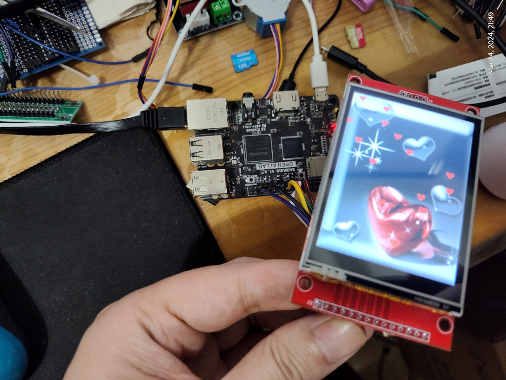

# RIotBoard
## Product Introduction
  * EAIDK 310: Arm cpu and ARM MaLI GPU ,Main chip uses the RK3228H of mainstream performance Arm Soc.
  * CPU: ARM 4 core Cortex-A53 ,64 bit processor
  * RAM:LPDDR3 1GB
  * Wifi :2.4G/5GHz,Bluetooth 5.0
  * Power:Micro USB 5v/2A HDMI:2.0, 1*Type -A
  * Operation system :Linux and Android 8.1,
  * Video code API :Hard decoding and hardcode

What works:
  - Mainline u-boot
  - Mainline stable kernel, latest stable version on build date.
  - Mainline ATF provided as Trusted Execution Environment
  - All 4 cores are working
  - Ethernet
  - fbdev with ILI9341

Releases:
  * Kernel 6.8.2, The latest stable version of the day.
  * Debian 12(bookworm)
  * default user: eaidk , password: 1234

## Test `ILI9341`

* lcd with eaidk connect table.

|  RK3328 CON1  | 2.8 inch SPI |
| :-----------: | :----------: |
| GPIO3_A0 (23) |     SCK      |
| GPIO3_A1 (19) |  SDI(MOSI)   |
| GPIO3_A2 (21) |  SDO(MISO)   |
| GPIO2_C4 (36) |      DC      |
| GPIO3_B0 (24) |      CS      |
| GPIO2_B7 (7)  |    RESET     |
|    VCC 3v3    |      BK      |
|    VCC 3v3    |     VCC      |
|      GND      |     GND      |


* device tree overlay plugin patch

```sh
/dts-v1/;
/plugin/;

#include <dt-bindings/gpio/gpio.h>
#include <dt-bindings/pinctrl/rockchip.h>
#include <dt-bindings/interrupt-controller/irq.h>

/{
    fragment@0 {
        target= <&spi0>;
        __overlay__ {
                /delete-property/ flash@0;
                status = "okay";
                #address-cells = <1>;
			          #size-cells = <0>;
                ili9341@0 {
                    compatible = "ilitek,ili9341", "spidev";
                    reg = <0>;
                    spi-max-frequency = <50000000>;
                    rotate = <0>;
                    bgr;
                    fps = <30>;
                    buswidth = <8>;
                    reset-gpios = <&gpio2 RK_PB7 GPIO_ACTIVE_LOW>;
                    dc-gpios = <&gpio2 RK_PC4 GPIO_ACTIVE_HIGH>;
                    debug = <0>;
            };
        };
    };
};
```
* if load above success , will show below in dmesg

```sh
[   66.204021] fbtft: module is from the staging directory, the quality is unknown, you have been warned.
[   66.208716] fb_ili9341: module is from the staging directory, the quality is unknown, you have been warned.
[   66.210464] fb_ili9341 spi0.0: fbtft_property_value: buswidth = 8
[   66.211049] fb_ili9341 spi0.0: fbtft_property_value: debug = 0
[   66.211576] fb_ili9341 spi0.0: fbtft_property_value: rotate = 270
[   66.212128] fb_ili9341 spi0.0: fbtft_property_value: fps = 30
[   66.507261] Console: switching to colour frame buffer device 40x30
[   66.508754] graphics fb0: fb_ili9341 frame buffer, 320x240, 150 KiB video memory, 16 KiB buffer memory, fps=31, spi0.0 at 50 MHz

```
* Now you can output `rgb565` bmp files  to LCD for display.

```sh
~ # tail --bytes 153600 /home/eaidk/ffmpeg_rgb565.bmp > /dev/fb0
```

* images





## Benchmarks

* CPU info

```sh
~$ lscpu
Architecture:             aarch64
  CPU op-mode(s):         32-bit, 64-bit
  Byte Order:             Little Endian
CPU(s):                   4
  On-line CPU(s) list:    0-3
Vendor ID:                ARM
  Model name:             Cortex-A53
    Model:                4
    Thread(s) per core:   1
    Core(s) per cluster:  4
    Socket(s):            -
    Cluster(s):           1
    Stepping:             r0p4
    CPU(s) scaling MHz:   78%
    CPU max MHz:          1296.0000
    CPU min MHz:          408.0000
    BogoMIPS:             48.00
    Flags:                fp asimd evtstrm aes pmull sha1 sha2 crc32 cpuid
NUMA:
  NUMA node(s):           1
  NUMA node0 CPU(s):      0-3
Vulnerabilities:
  Gather data sampling:   Not affected
  Itlb multihit:          Not affected
  L1tf:                   Not affected
  Mds:                    Not affected
  Meltdown:               Not affected
  Mmio stale data:        Not affected
  Reg file data sampling: Not affected
  Retbleed:               Not affected
  Spec rstack overflow:   Not affected
  Spec store bypass:      Not affected
  Spectre v1:             Mitigation; __user pointer sanitization
  Spectre v2:             Not affected
  Srbds:                  Not affected
  Tsx async abort:        Not affected

~$  cat /proc/cpuinfo
processor	: 0
BogoMIPS	: 48.00
Features	: fp asimd evtstrm aes pmull sha1 sha2 crc32 cpuid
CPU implementer	: 0x41
CPU architecture: 8
CPU variant	: 0x0
CPU part	: 0xd03
CPU revision	: 4

processor	: 1
BogoMIPS	: 48.00
Features	: fp asimd evtstrm aes pmull sha1 sha2 crc32 cpuid
CPU implementer	: 0x41
CPU architecture: 8
CPU variant	: 0x0
CPU part	: 0xd03
CPU revision	: 4

processor	: 2
BogoMIPS	: 48.00
Features	: fp asimd evtstrm aes pmull sha1 sha2 crc32 cpuid
CPU implementer	: 0x41
CPU architecture: 8
CPU variant	: 0x0
CPU part	: 0xd03
CPU revision	: 4

processor	: 3
BogoMIPS	: 48.00
Features	: fp asimd evtstrm aes pmull sha1 sha2 crc32 cpuid
CPU implementer	: 0x41
CPU architecture: 8
CPU variant	: 0x0
CPU part	: 0xd03
CPU revision	: 4
```

* openssl (crypto)

```sh
eaidk@eaidk-310:~$ openssl speed -elapsed -evp aes-128-gcm aes-128-cbc sha256
You have chosen to measure elapsed time instead of user CPU time.
Doing sha256 for 3s on 16 size blocks: 1729302 sha256's in 3.00s
Doing sha256 for 3s on 64 size blocks: 1628260 sha256's in 3.00s
Doing sha256 for 3s on 256 size blocks: 1381553 sha256's in 3.00s
Doing sha256 for 3s on 1024 size blocks: 852353 sha256's in 3.00s
Doing sha256 for 3s on 8192 size blocks: 187225 sha256's in 3.00s
Doing sha256 for 3s on 16384 size blocks: 98572 sha256's in 3.00s
Doing aes-128-cbc for 3s on 16 size blocks: 18429939 aes-128-cbc's in 3.00s
Doing aes-128-cbc for 3s on 64 size blocks: 14175832 aes-128-cbc's in 3.00s
Doing aes-128-cbc for 3s on 256 size blocks: 7219643 aes-128-cbc's in 3.00s
Doing aes-128-cbc for 3s on 1024 size blocks: 2508817 aes-128-cbc's in 3.00s
Doing aes-128-cbc for 3s on 8192 size blocks: 353689 aes-128-cbc's in 3.00s
Doing aes-128-cbc for 3s on 16384 size blocks: 177769 aes-128-cbc's in 3.00s
Doing AES-128-GCM for 3s on 16 size blocks: 10169150 AES-128-GCM's in 3.00s
Doing AES-128-GCM for 3s on 64 size blocks: 7809045 AES-128-GCM's in 3.00s
Doing AES-128-GCM for 3s on 256 size blocks: 4100438 AES-128-GCM's in 3.00s
Doing AES-128-GCM for 3s on 1024 size blocks: 1524611 AES-128-GCM's in 3.00s
Doing AES-128-GCM for 3s on 8192 size blocks: 225044 AES-128-GCM's in 3.00s
Doing AES-128-GCM for 3s on 16384 size blocks: 113699 AES-128-GCM's in 3.00s
version: 3.0.11
built on: Mon Oct 23 17:52:22 2023 UTC
options: bn(64,64)
compiler: gcc -fPIC -pthread -Wa,--noexecstack -Wall -fzero-call-used-regs=used-gpr -DOPENSSL_TLS_SECURITY_LEVEL=2 -Wa,--noexecstack -g -O2 -ffile-prefix-map=/build/reproducible-path/openssl-3.0.11=. -fstack-protector-strong -Wformat -Werror=format-security -DOPENSSL_USE_NODELETE -DOPENSSL_PIC -DOPENSSL_BUILDING_OPENSSL -DNDEBUG -Wdate-time -D_FORTIFY_SOURCE=2
CPUINFO: OPENSSL_armcap=0xbd
The 'numbers' are in 1000s of bytes per second processed.
type             16 bytes     64 bytes    256 bytes   1024 bytes   8192 bytes  16384 bytes
sha256            9222.94k    34736.21k   117892.52k   290936.49k   511249.07k   538334.55k
aes-128-cbc      98293.01k   302417.75k   616076.20k   856342.87k   965806.76k   970855.77k
AES-128-GCM      54235.47k   166592.96k   349904.04k   520400.55k   614520.15k   620948.14k


```
## tailscale

```sh
eaidk@eaidk-310:~$ ifconfig tailscale0
tailscale0: flags=4305<UP,POINTOPOINT,RUNNING,NOARP,MULTICAST>  mtu 1280
        inet6 fe80::a62c:89cc:8c9f:8f1f  prefixlen 64  scopeid 0x20<link>
        unspec 00-00-00-00-00-00-00-00-00-00-00-00-00-00-00-00  txqueuelen 500  (UNSPEC)
        RX packets 0  bytes 0 (0.0 B)
        RX errors 0  dropped 0  overruns 0  frame 0
        TX packets 3  bytes 144 (144.0 B)
        TX errors 0  dropped 0 overruns 0  carrier 0  collisions 0

```

## Boot log (booting from SD Card)

```sh
eaidk@eaidk-310:~$ dmesg
[    0.000000] Booting Linux on physical CPU 0x0000000000 [0x410fd034]
[    0.000000] Linux version 6.8.2-rk3328-eaidk-310 (yjdwbj@gmail.com) (aarch64-linux-gnu-gcc (Debian 12.2.0-14) 12.2.0, GNU ld (GNU Binutils for Debian) 2.40) #4 SMP Thu Mar 28 23:03:47 CST 2024
[    0.000000] Machine model: EAIDK-310 Rock64, lcy-v1
[    0.000000] earlycon: uart0 at MMIO32 0x00000000ff130000 (options '1500000n8')
[    0.000000] printk: legacy bootconsole [uart0] enabled
[    0.000000] efi: UEFI not found.
[    0.000000] NUMA: No NUMA configuration found
[    0.000000] NUMA: Faking a node at [mem 0x0000000000200000-0x000000003fffffff]
[    0.000000] NUMA: NODE_DATA [mem 0x3fdc19c0-0x3fdc3fff]
[    0.000000] Zone ranges:
[    0.000000]   DMA      [mem 0x0000000000200000-0x000000003fffffff]
[    0.000000]   DMA32    empty
[    0.000000]   Normal   empty
[    0.000000] Movable zone start for each node
[    0.000000] Early memory node ranges
[    0.000000]   node   0: [mem 0x0000000000200000-0x000000003fffffff]
[    0.000000] Initmem setup node 0 [mem 0x0000000000200000-0x000000003fffffff]
[    0.000000] On node 0, zone DMA: 512 pages in unavailable ranges
[    0.000000] cma: Reserved 128 MiB at 0x0000000034400000 on node -1
[    0.000000] psci: probing for conduit method from DT.
[    0.000000] psci: PSCIv1.0 detected in firmware.
[    0.000000] psci: Using standard PSCI v0.2 function IDs
[    0.000000] psci: MIGRATE_INFO_TYPE not supported.
[    0.000000] psci: SMC Calling Convention v1.0
[    0.000000] percpu: Embedded 29 pages/cpu s81320 r8192 d29272 u118784
[    0.000000] pcpu-alloc: s81320 r8192 d29272 u118784 alloc=29*4096
[    0.000000] pcpu-alloc: [0] 0 [0] 1 [0] 2 [0] 3
[    0.000000] Detected VIPT I-cache on CPU0
[    0.000000] CPU features: detected: ARM erratum 845719
[    0.000000] alternatives: applying boot alternatives
[    0.000000] Kernel command line: root=UUID=88baa782-9f2e-43a3-8e8d-03a6ff9c7c7e rootwait rootfstype=ext4 net.ifnames=0  earlycon console=ttyS2,1500000n8 console=tty1 consoleblank=0 loglevel=7
[    0.000000] Dentry cache hash table entries: 131072 (order: 8, 1048576 bytes, linear)
[    0.000000] Inode-cache hash table entries: 65536 (order: 7, 524288 bytes, linear)
[    0.000000] Fallback order for Node 0: 0
[    0.000000] Built 1 zonelists, mobility grouping on.  Total pages: 257544
[    0.000000] Policy zone: DMA
[    0.000000] mem auto-init: stack:off, heap alloc:on, heap free:off
[    0.000000] software IO TLB: SWIOTLB bounce buffer size adjusted to 0MB
[    0.000000] software IO TLB: area num 4.
[    0.000000] software IO TLB: mapped [mem 0x000000003ea80000-0x000000003eb80000] (1MB)
[    0.000000] Memory: 854840K/1046528K available (15552K kernel code, 2072K rwdata, 5544K rodata, 4224K init, 519K bss, 60616K reserved, 131072K cma-reserved)
[    0.000000] SLUB: HWalign=64, Order=0-3, MinObjects=0, CPUs=4, Nodes=1
[    0.000000] trace event string verifier disabled
[    0.000000] workqueue: name exceeds WQ_NAME_LEN. Truncating to: events_freezable_power_efficien
[    0.000000] rcu: Hierarchical RCU implementation.
[    0.000000] rcu: 	RCU event tracing is enabled.
[    0.000000] rcu: 	RCU restricting CPUs from NR_CPUS=8 to nr_cpu_ids=4.
[    0.000000] 	Tracing variant of Tasks RCU enabled.
[    0.000000] rcu: RCU calculated value of scheduler-enlistment delay is 30 jiffies.
[    0.000000] rcu: Adjusting geometry for rcu_fanout_leaf=16, nr_cpu_ids=4
[    0.000000] NR_IRQS: 64, nr_irqs: 64, preallocated irqs: 0
[    0.000000] Root IRQ handler: gic_handle_irq
[    0.000000] GIC: Using split EOI/Deactivate mode
[    0.000000] rcu: srcu_init: Setting srcu_struct sizes based on contention.
[    0.000000] arch_timer: cp15 timer(s) running at 24.00MHz (phys).
[    0.000000] clocksource: arch_sys_counter: mask: 0xffffffffffffff max_cycles: 0x588fe9dc0, max_idle_ns: 440795202592 ns
[    0.000001] sched_clock: 56 bits at 24MHz, resolution 41ns, wraps every 4398046511097ns
[    0.001705] Console: colour dummy device 80x25
[    0.002142] printk: legacy console [tty1] enabled
[    0.002596] printk: legacy bootconsole [uart0] disabled
[    0.003229] Calibrating delay loop (skipped), value calculated using timer frequency.. 48.00 BogoMIPS (lpj=80000)
[    0.003268] pid_max: default: 32768 minimum: 301
[    0.003426] LSM: initializing lsm=capability,yama,apparmor,integrity
[    0.003490] Yama: becoming mindful.
[    0.003651] AppArmor: AppArmor initialized
[    0.003733] stackdepot: allocating hash table of 65536 entries via kvcalloc
[    0.004759] Mount-cache hash table entries: 2048 (order: 2, 16384 bytes, linear)
[    0.004799] Mountpoint-cache hash table entries: 2048 (order: 2, 16384 bytes, linear)
[    0.008412] RCU Tasks Trace: Setting shift to 2 and lim to 1 rcu_task_cb_adjust=1.
[    0.008920] rcu: Hierarchical SRCU implementation.
[    0.008950] rcu: 	Max phase no-delay instances is 1000.
[    0.010756] EFI services will not be available.
[    0.011452] smp: Bringing up secondary CPUs ...
[    0.012662] Detected VIPT I-cache on CPU1
[    0.012848] CPU1: Booted secondary processor 0x0000000001 [0x410fd034]
[    0.014096] Detected VIPT I-cache on CPU2
[    0.014270] CPU2: Booted secondary processor 0x0000000002 [0x410fd034]
[    0.015618] Detected VIPT I-cache on CPU3
[    0.015798] CPU3: Booted secondary processor 0x0000000003 [0x410fd034]
[    0.015994] smp: Brought up 1 node, 4 CPUs
[    0.016101] SMP: Total of 4 processors activated.
[    0.016120] CPU: All CPU(s) started at EL2
[    0.016140] CPU features: detected: 32-bit EL0 Support
[    0.016160] CPU features: detected: CRC32 instructions
[    0.016260] alternatives: applying system-wide alternatives
[    0.019226] devtmpfs: initialized
[    0.033431] clocksource: jiffies: mask: 0xffffffff max_cycles: 0xffffffff, max_idle_ns: 6370867519511994 ns
[    0.033545] futex hash table entries: 1024 (order: 4, 65536 bytes, linear)
[    0.040269] pinctrl core: initialized pinctrl subsystem
[    0.041180] DMI not present or invalid.
[    0.042813] NET: Registered PF_NETLINK/PF_ROUTE protocol family
[    0.045830] DMA: preallocated 128 KiB GFP_KERNEL pool for atomic allocations
[    0.046552] DMA: preallocated 128 KiB GFP_KERNEL|GFP_DMA pool for atomic allocations
[    0.047734] DMA: preallocated 128 KiB GFP_KERNEL|GFP_DMA32 pool for atomic allocations
[    0.048515] audit: initializing netlink subsys (disabled)
[    0.049048] audit: type=2000 audit(0.049:1): state=initialized audit_enabled=0 res=1
[    0.050329] thermal_sys: Registered thermal governor 'fair_share'
[    0.050343] thermal_sys: Registered thermal governor 'bang_bang'
[    0.050374] thermal_sys: Registered thermal governor 'step_wise'
[    0.050395] thermal_sys: Registered thermal governor 'user_space'
[    0.050536] cpuidle: using governor menu
[    0.050953] hw-breakpoint: found 6 breakpoint and 4 watchpoint registers.
[    0.051168] ASID allocator initialised with 65536 entries
[    0.051612] Serial: AMBA PL011 UART driver
[    0.061991] platform ff370000.vop: Fixed dependency cycle(s) with /hdmi@ff3c0000
[    0.062157] platform ff3c0000.hdmi: Fixed dependency cycle(s) with /vop@ff370000
[    0.074358] gpio gpiochip0: Static allocation of GPIO base is deprecated, use dynamic allocation.
[    0.075034] rockchip-gpio ff210000.gpio: probed /pinctrl/gpio@ff210000
[    0.075885] gpio gpiochip1: Static allocation of GPIO base is deprecated, use dynamic allocation.
[    0.076472] rockchip-gpio ff220000.gpio: probed /pinctrl/gpio@ff220000
[    0.077232] gpio gpiochip2: Static allocation of GPIO base is deprecated, use dynamic allocation.
[    0.077773] rockchip-gpio ff230000.gpio: probed /pinctrl/gpio@ff230000
[    0.078371] gpio gpiochip3: Static allocation of GPIO base is deprecated, use dynamic allocation.
[    0.078867] rockchip-gpio ff240000.gpio: probed /pinctrl/gpio@ff240000
[    0.083672] Modules: 25744 pages in range for non-PLT usage
[    0.083699] Modules: 517264 pages in range for PLT usage
[    0.085284] HugeTLB: registered 1.00 GiB page size, pre-allocated 0 pages
[    0.085355] HugeTLB: 0 KiB vmemmap can be freed for a 1.00 GiB page
[    0.085380] HugeTLB: registered 32.0 MiB page size, pre-allocated 0 pages
[    0.085400] HugeTLB: 0 KiB vmemmap can be freed for a 32.0 MiB page
[    0.085423] HugeTLB: registered 2.00 MiB page size, pre-allocated 0 pages
[    0.085443] HugeTLB: 0 KiB vmemmap can be freed for a 2.00 MiB page
[    0.085467] HugeTLB: registered 64.0 KiB page size, pre-allocated 0 pages
[    0.085488] HugeTLB: 0 KiB vmemmap can be freed for a 64.0 KiB page
[    0.087657] cryptd: max_cpu_qlen set to 1000
[    0.146426] raid6: neonx8   gen()  1128 MB/s
[    0.203195] raid6: neonx4   gen()  1107 MB/s
[    0.259947] raid6: neonx2   gen()  1056 MB/s
[    0.316701] raid6: neonx1   gen()   908 MB/s
[    0.373468] raid6: int64x8  gen()   707 MB/s
[    0.430238] raid6: int64x4  gen()   782 MB/s
[    0.486995] raid6: int64x2  gen()   698 MB/s
[    0.543739] raid6: int64x1  gen()   515 MB/s
[    0.543761] raid6: using algorithm neonx8 gen() 1128 MB/s
[    0.600496] raid6: .... xor() 827 MB/s, rmw enabled
[    0.600520] raid6: using neon recovery algorithm
[    0.601621] iommu: Default domain type: Translated
[    0.601680] iommu: DMA domain TLB invalidation policy: strict mode
[    0.603429] SCSI subsystem initialized
[    0.603873] libata version 3.00 loaded.
[    0.604278] usbcore: registered new interface driver usbfs
[    0.604358] usbcore: registered new interface driver hub
[    0.604431] usbcore: registered new device driver usb
[    0.605124] pps_core: LinuxPPS API ver. 1 registered
[    0.605151] pps_core: Software ver. 5.3.6 - Copyright 2005-2007 Rodolfo Giometti <giometti@linux.it>
[    0.605198] PTP clock support registered
[    0.605291] EDAC MC: Ver: 3.0.0
[    0.606296] scmi_core: SCMI protocol bus registered
[    0.608354] NetLabel: Initializing
[    0.608405] NetLabel:  domain hash size = 128
[    0.608423] NetLabel:  protocols = UNLABELED CIPSOv4 CALIPSO
[    0.608564] NetLabel:  unlabeled traffic allowed by default
[    0.608920] vgaarb: loaded
[    0.609712] clocksource: Switched to clocksource arch_sys_counter
[    0.610999] VFS: Disk quotas dquot_6.6.0
[    0.611132] VFS: Dquot-cache hash table entries: 512 (order 0, 4096 bytes)
[    0.612304] AppArmor: AppArmor Filesystem Enabled
[    0.626758] NET: Registered PF_INET protocol family
[    0.627105] IP idents hash table entries: 16384 (order: 5, 131072 bytes, linear)
[    0.629324] tcp_listen_portaddr_hash hash table entries: 512 (order: 1, 8192 bytes, linear)
[    0.629548] Table-perturb hash table entries: 65536 (order: 6, 262144 bytes, linear)
[    0.630069] TCP established hash table entries: 8192 (order: 4, 65536 bytes, linear)
[    0.630348] TCP bind hash table entries: 8192 (order: 6, 262144 bytes, linear)
[    0.630744] TCP: Hash tables configured (established 8192 bind 8192)
[    0.631214] MPTCP token hash table entries: 1024 (order: 2, 24576 bytes, linear)
[    0.631381] UDP hash table entries: 512 (order: 2, 16384 bytes, linear)
[    0.631457] UDP-Lite hash table entries: 512 (order: 2, 16384 bytes, linear)
[    0.631815] NET: Registered PF_UNIX/PF_LOCAL protocol family
[    0.631896] NET: Registered PF_XDP protocol family
[    0.631935] PCI: CLS 0 bytes, default 64
[    0.632436] Trying to unpack rootfs image as initramfs...
[    0.642264] Initialise system trusted keyrings
[    0.642498] Key type blacklist registered
[    0.643202] workingset: timestamp_bits=44 max_order=18 bucket_order=0
[    0.643357] zbud: loaded
[    0.644416] squashfs: version 4.0 (2009/01/31) Phillip Lougher
[    0.645387] fuse: init (API version 7.39)
[    0.649210] integrity: Platform Keyring initialized
[    0.758228] xor: measuring software checksum speed
[    0.766232]    8regs           :  1261 MB/sec
[    0.774177]    32regs          :  1252 MB/sec
[    0.782593]    arm64_neon      :  1184 MB/sec
[    0.782634] xor: using function: 8regs (1261 MB/sec)
[    0.782676] Key type asymmetric registered
[    0.782702] Asymmetric key parser 'x509' registered
[    0.782935] Block layer SCSI generic (bsg) driver version 0.4 loaded (major 247)
[    0.783431] io scheduler mq-deadline registered
[    0.783481] io scheduler kyber registered
[    0.783598] io scheduler bfq registered
[    0.796838] dma-pl330 ff1f0000.dma-controller: Loaded driver for PL330 DMAC-241330
[    0.796911] dma-pl330 ff1f0000.dma-controller: 	DBUFF-128x8bytes Num_Chans-8 Num_Peri-20 Num_Events-16
[    0.800010] Serial: 8250/16550 driver, 8 ports, IRQ sharing disabled
[    0.808715] ff110000.serial: ttyS0 at MMIO 0xff110000 (irq = 21, base_baud = 1500000) is a 16550A
[    0.809468] serial serial0: tty port ttyS0 registered
[    0.811670] ff130000.serial: ttyS2 at MMIO 0xff130000 (irq = 22, base_baud = 1500000) is a 16550A
[    0.811820] printk: legacy console [ttyS2] enabled
[    0.912699] Serial: AMBA driver
[    0.917517] rockchip-vop ff370000.vop: Adding to iommu group 0
[    0.936875] loop: module loaded
[    0.945063] spi-nor spi0.0: unrecognized JEDEC id bytes: ff ff ff ff ff ff
[    0.948442] tun: Universal TUN/TAP device driver, 1.6
[    0.952836] dwc2 ff580000.usb: supply vusb_d not found, using dummy regulator
[    0.953865] dwc2 ff580000.usb: supply vusb_a not found, using dummy regulator
[    0.968869] dwc2 ff580000.usb: DWC OTG Controller
[    0.969412] dwc2 ff580000.usb: new USB bus registered, assigned bus number 1
[    0.970156] dwc2 ff580000.usb: irq 28, io mem 0xff580000
[    0.971182] usb usb1: New USB device found, idVendor=1d6b, idProduct=0002, bcdDevice= 6.08
[    0.971971] usb usb1: New USB device strings: Mfr=3, Product=2, SerialNumber=1
[    0.972649] usb usb1: Product: DWC OTG Controller
[    0.973139] usb usb1: Manufacturer: Linux 6.8.2-rk3328-eaidk-310 dwc2_hsotg
[    0.973791] usb usb1: SerialNumber: ff580000.usb
[    0.975492] hub 1-0:1.0: USB hub found
[    0.976125] hub 1-0:1.0: 1 port detected
[    0.980170] xhci-hcd xhci-hcd.0.auto: xHCI Host Controller
[    0.980745] xhci-hcd xhci-hcd.0.auto: new USB bus registered, assigned bus number 2
[    0.981700] xhci-hcd xhci-hcd.0.auto: hcc params 0x0220fe64 hci version 0x110 quirks 0x0000008002000010
[    0.981829] ehci-platform ff5c0000.usb: EHCI Host Controller
[    0.981868] ohci-platform ff5d0000.usb: Generic Platform OHCI controller
[    0.981913] ohci-platform ff5d0000.usb: new USB bus registered, assigned bus number 3
[    0.982122] ohci-platform ff5d0000.usb: irq 30, io mem 0xff5d0000
[    0.982622] xhci-hcd xhci-hcd.0.auto: irq 27, io mem 0xff600000
[    0.983187] ehci-platform ff5c0000.usb: new USB bus registered, assigned bus number 4
[    0.984097] xhci-hcd xhci-hcd.0.auto: xHCI Host Controller
[    0.984706] ehci-platform ff5c0000.usb: irq 29, io mem 0xff5c0000
[    0.985064] xhci-hcd xhci-hcd.0.auto: new USB bus registered, assigned bus number 5
[    0.988537] xhci-hcd xhci-hcd.0.auto: Host supports USB 3.0 SuperSpeed
[    0.989770] usb usb2: New USB device found, idVendor=1d6b, idProduct=0002, bcdDevice= 6.08
[    0.990563] usb usb2: New USB device strings: Mfr=3, Product=2, SerialNumber=1
[    0.991226] usb usb2: Product: xHCI Host Controller
[    0.991675] usb usb2: Manufacturer: Linux 6.8.2-rk3328-eaidk-310 xhci-hcd
[    0.992293] usb usb2: SerialNumber: xhci-hcd.0.auto
[    0.994166] hub 2-0:1.0: USB hub found
[    0.994705] hub 2-0:1.0: 1 port detected
[    0.996017] usb usb5: We don't know the algorithms for LPM for this host, disabling LPM.
[    0.997161] usb usb5: New USB device found, idVendor=1d6b, idProduct=0003, bcdDevice= 6.08
[    0.997968] usb usb5: New USB device strings: Mfr=3, Product=2, SerialNumber=1
[    0.998643] usb usb5: Product: xHCI Host Controller
[    0.999093] usb usb5: Manufacturer: Linux 6.8.2-rk3328-eaidk-310 xhci-hcd
[    0.999771] usb usb5: SerialNumber: xhci-hcd.0.auto
[    0.999810] ehci-platform ff5c0000.usb: USB 2.0 started, EHCI 1.00
[    1.001671] hub 5-0:1.0: USB hub found
[    1.002138] hub 5-0:1.0: 1 port detected
[    1.003772] usbcore: registered new interface driver usb-storage
[    1.003858] usb usb4: New USB device found, idVendor=1d6b, idProduct=0002, bcdDevice= 6.08
[    1.005116] usb usb4: New USB device strings: Mfr=3, Product=2, SerialNumber=1
[    1.005779] usb usb4: Product: EHCI Host Controller
[    1.006231] usb usb4: Manufacturer: Linux 6.8.2-rk3328-eaidk-310 ehci_hcd
[    1.006968] usb usb4: SerialNumber: ff5c0000.usb
[    1.007334] mousedev: PS/2 mouse device common for all mice
[    1.008411] hub 4-0:1.0: USB hub found
[    1.008838] i2c_dev: i2c /dev entries driver
[    1.008901] hub 4-0:1.0: 1 port detected
[    1.020857] rk808-regulator rk808-regulator.2.auto: there is no dvs0 gpio
[    1.021558] rk808-regulator rk808-regulator.2.auto: there is no dvs1 gpio
[    1.044362] usb usb3: New USB device found, idVendor=1d6b, idProduct=0001, bcdDevice= 6.08
[    1.045171] usb usb3: New USB device strings: Mfr=3, Product=2, SerialNumber=1
[    1.045841] usb usb3: Product: Generic Platform OHCI controller
[    1.046434] usb usb3: Manufacturer: Linux 6.8.2-rk3328-eaidk-310 ohci_hcd
[    1.047076] usb usb3: SerialNumber: ff5d0000.usb
[    1.048713] hub 3-0:1.0: USB hub found
[    1.049191] hub 3-0:1.0: 1 port detected
[    1.053835] rk808-rtc rk808-rtc.4.auto: registered as rtc0
[    1.056348] rk808-rtc rk808-rtc.4.auto: setting system clock to 2024-03-29T08:38:29 UTC (1711701509)
[    1.059981] input: rk805 pwrkey as /devices/platform/ff160000.i2c/i2c-1/1-0018/rk805-pwrkey.6.auto/input/input0
[    1.065497] rockchip-thermal ff250000.tsadc: Missing tshut mode property, using default (cru)
[    1.066339] rockchip-thermal ff250000.tsadc: Missing tshut-polarity property, using default (low)
[    1.077934] ledtrig-cpu: registered to indicate activity on CPUs
[    1.079460] hid: raw HID events driver (C) Jiri Kosina
[    1.080311] usbcore: registered new interface driver usbhid
[    1.080858] usbhid: USB HID core driver
[    1.085596] hw perfevents: enabled with armv8_cortex_a53 PMU driver, 7 counters available
[    1.089450] drop_monitor: Initializing network drop monitor service
[    1.090756] NET: Registered PF_INET6 protocol family
[    1.259965] usb 4-1: new high-speed USB device number 2 using ehci-platform
[    1.409430] usb 4-1: New USB device found, idVendor=05e3, idProduct=0608, bcdDevice=85.37
[    1.410254] usb 4-1: New USB device strings: Mfr=0, Product=1, SerialNumber=0
[    1.410916] usb 4-1: Product: USB2.0 Hub
[    1.412939] hub 4-1:1.0: USB hub found
[    1.413778] hub 4-1:1.0: 4 ports detected
[    1.725450] Freeing initrd memory: 10752K
[    1.802378] Segment Routing with IPv6
[    1.802903] In-situ OAM (IOAM) with IPv6
[    1.803458] NET: Registered PF_PACKET protocol family
[    1.804397] 8021q: 802.1Q VLAN Support v1.8
[    1.804908] Key type dns_resolver registered
[    1.820396] registered taskstats version 1
[    1.821088] Loading compiled-in X.509 certificates
[    1.862700] zswap: loaded using pool zstd/z3fold
[    1.864440] Key type .fscrypt registered
[    1.864849] Key type fscrypt-provisioning registered
[    1.870220] Btrfs loaded, zoned=yes, fsverity=yes
[    1.871027] Key type encrypted registered
[    1.871439] AppArmor: AppArmor sha256 policy hashing enabled
[    1.907441] rockchip-drm display-subsystem: bound ff370000.vop (ops vop_component_ops)
[    1.908332] dwhdmi-rockchip ff3c0000.hdmi: supply avdd-0v9 not found, using dummy regulator
[    1.909357] dwhdmi-rockchip ff3c0000.hdmi: supply avdd-1v8 not found, using dummy regulator
[    1.910742] dwhdmi-rockchip ff3c0000.hdmi: Detected HDMI TX controller v2.11a with HDCP (inno_dw_hdmi_phy2)
[    1.913230] dwhdmi-rockchip ff3c0000.hdmi: registered DesignWare HDMI I2C bus driver
[    1.914512] rockchip-drm display-subsystem: bound ff3c0000.hdmi (ops dw_hdmi_rockchip_ops)
[    1.916824] [drm] Initialized rockchip 1.0.0 20140818 for display-subsystem on minor 0
[    1.917753] rockchip-drm display-subsystem: [drm] Cannot find any crtc or sizes
[    1.918595] rockchip-drm display-subsystem: [drm] Cannot find any crtc or sizes
[    1.920490] clk: Disabling unused clocks
[    1.925461] Freeing unused kernel memory: 4224K
[    1.926044] Run /init as init process
[    1.926446]   with arguments:
[    1.926460]     /init
[    1.926471]   with environment:
[    1.926480]     HOME=/
[    1.926489]     TERM=linux
[    2.780376] gpio-syscon ff100000.syscon:gpio: can't read the data register offset!
[    2.918815] Synopsys Designware Multimedia Card Interface Driver
[    2.927432] dwmmc_rockchip ff500000.mmc: IDMAC supports 32-bit address mode.
[    2.927497] dwmmc_rockchip ff520000.mmc: IDMAC supports 32-bit address mode.
[    2.928166] dwmmc_rockchip ff500000.mmc: Using internal DMA controller.
[    2.928809] dwmmc_rockchip ff520000.mmc: Using internal DMA controller.
[    2.929362] dwmmc_rockchip ff500000.mmc: Version ID is 270a
[    2.929383] dwmmc_rockchip ff520000.mmc: Version ID is 270a
[    2.930134] dwmmc_rockchip ff500000.mmc: DW MMC controller at irq 48,32 bit host data width,256 deep fifo
[    2.931408] dwmmc_rockchip ff510000.mmc: IDMAC supports 32-bit address mode.
[    2.932593] dwmmc_rockchip ff510000.mmc: Using internal DMA controller.
[    2.933282] dwmmc_rockchip ff510000.mmc: Version ID is 270a
[    2.935484] dwmmc_rockchip ff510000.mmc: DW MMC controller at irq 50,32 bit host data width,256 deep fifo
[    2.937142] dwmmc_rockchip ff520000.mmc: DW MMC controller at irq 49,32 bit host data width,256 deep fifo
[    2.943588] mmc_host mmc2: card is non-removable.
[    2.946549] mmc_host mmc0: Bus speed (slot 0) = 400000Hz (slot req 400000Hz, actual 400000HZ div = 0)
[    2.958275] mmc_host mmc2: Bus speed (slot 0) = 400000Hz (slot req 400000Hz, actual 400000HZ div = 0)
[    3.016665] mmc_host mmc0: Bus speed (slot 0) = 150000000Hz (slot req 150000000Hz, actual 150000000HZ div = 0)
[    3.076119] mmc_host mmc2: Bus speed (slot 0) = 50000000Hz (slot req 52000000Hz, actual 50000000HZ div = 0)
[    3.078775] mmc_host mmc2: Bus speed (slot 0) = 150000000Hz (slot req 150000000Hz, actual 150000000HZ div = 0)
[    3.320236] dwmmc_rockchip ff500000.mmc: Successfully tuned phase to 172
[    3.320929] mmc0: new ultra high speed SDR104 SDXC card at address 1234
[    3.347855] dwmmc_rockchip ff520000.mmc: Successfully tuned phase to 202
[    3.348640] mmc2: new HS200 MMC card at address 0001
[    7.573629] rockchip-pm-domain ff100000.syscon:power-controller: failed to get ack on domain 'hevc', val=0x88220
[    7.577728] dwmmc_rockchip ff510000.mmc: IDMAC supports 32-bit address mode.
[    7.578490] dwmmc_rockchip ff510000.mmc: Using internal DMA controller.
[    7.579120] dwmmc_rockchip ff510000.mmc: Version ID is 270a
[    7.579753] dwmmc_rockchip ff510000.mmc: DW MMC controller at irq 50,32 bit host data width,256 deep fifo
[    7.581034] dwmmc_rockchip ff510000.mmc: allocated mmc-pwrseq
[    7.581602] mmc_host mmc1: card is non-removable.
[    7.593257] mmc_host mmc1: Bus speed (slot 0) = 400000Hz (slot req 400000Hz, actual 400000HZ div = 0)
[    7.597192] mmcblk0: mmc0:1234 SA128 116 GiB
[    7.609788]  mmcblk0: p1 p2
[    7.611109] rk_gmac-dwmac ff550000.ethernet: IRQ eth_wake_irq not found
[    7.611781] rk_gmac-dwmac ff550000.ethernet: IRQ eth_lpi not found
[    7.613089] rk_gmac-dwmac ff550000.ethernet: PTP uses main clock
[    7.613498] mmcblk2: mmc2:0001 HBD08G 7.28 GiB
[    7.614303] rk_gmac-dwmac ff550000.ethernet: clock input or output? (output).
[    7.615075] rk_gmac-dwmac ff550000.ethernet: Can not read property: tx_delay.
[    7.615759] rk_gmac-dwmac ff550000.ethernet: set tx_delay to 0x30
[    7.616332] rk_gmac-dwmac ff550000.ethernet: Can not read property: rx_delay.
[    7.617082] rk_gmac-dwmac ff550000.ethernet: set rx_delay to 0x10
[    7.617701] rk_gmac-dwmac ff550000.ethernet: integrated PHY? (yes).
[    7.623456] rk_gmac-dwmac ff550000.ethernet: init for RMII
[    7.623675]  mmcblk2: p1 p2 p3 p4 p5 p6 p7 p8 p9
[    7.628461] mmcblk2boot0: mmc2:0001 HBD08G 4.00 MiB
[    7.633360] mmcblk2boot1: mmc2:0001 HBD08G 4.00 MiB
[    7.637713] mmcblk2rpmb: mmc2:0001 HBD08G 4.00 MiB, chardev (243:0)
[    7.639915] mmc_host mmc1: Bus speed (slot 0) = 300000Hz (slot req 300000Hz, actual 300000HZ div = 0)
[    7.660666] rk_gmac-dwmac ff550000.ethernet: User ID: 0x10, Synopsys ID: 0x35
[    7.661396] rk_gmac-dwmac ff550000.ethernet: 	DWMAC1000
[    7.661894] rk_gmac-dwmac ff550000.ethernet: DMA HW capability register supported
[    7.662583] rk_gmac-dwmac ff550000.ethernet: RX Checksum Offload Engine supported
[    7.663328] rk_gmac-dwmac ff550000.ethernet: COE Type 2
[    7.663835] rk_gmac-dwmac ff550000.ethernet: TX Checksum insertion supported
[    7.664478] rk_gmac-dwmac ff550000.ethernet: Wake-Up On Lan supported
[    7.665555] rk_gmac-dwmac ff550000.ethernet: Normal descriptors
[    7.666152] rk_gmac-dwmac ff550000.ethernet: Ring mode enabled
[    7.666763] rk_gmac-dwmac ff550000.ethernet: Enable RX Mitigation via HW Watchdog Timer
[    7.686735] mmc_host mmc1: Bus speed (slot 0) = 200000Hz (slot req 200000Hz, actual 200000HZ div = 0)
[    7.740102] mmc_host mmc1: Bus speed (slot 0) = 100000Hz (slot req 100000Hz, actual 100000HZ div = 0)
[    7.802265] mmc1: Failed to initialize a non-removable card
[    7.951477] EXT4-fs (mmcblk0p2): INFO: recovery required on readonly filesystem
[    7.952688] EXT4-fs (mmcblk0p2): write access will be enabled during recovery
[   10.669615] EXT4-fs (mmcblk0p2): recovery complete
[   10.795827] EXT4-fs (mmcblk0p2): mounted filesystem 88baa782-9f2e-43a3-8e8d-03a6ff9c7c7e ro with ordered data mode. Quota mode: none.
[   11.441100] systemd[1]: Inserted module 'autofs4'
[   11.565433] systemd[1]: systemd 252.22-1~deb12u1 running in system mode (+PAM +AUDIT +SELINUX +APPARMOR +IMA +SMACK +SECCOMP +GCRYPT -GNUTLS +OPENSSL +ACL +BLKID +CURL +ELFUTILS +FIDO2 +IDN2 -IDN +IPTC +KMOD +LIBCRYPTSETUP +LIBFDISK +PCRE2 -PWQUALITY +P11KIT +QRENCODE +TPM2 +BZIP2 +LZ4 +XZ +ZLIB +ZSTD -BPF_FRAMEWORK -XKBCOMMON +UTMP +SYSVINIT default-hierarchy=unified)
[   11.568548] systemd[1]: Detected architecture arm64.
[   11.576772] systemd[1]: Hostname set to <eaidk-310>.
[   11.770789] dw-apb-uart ff130000.serial: forbid DMA for kernel console
[   12.255587] systemd[1]: /etc/systemd/system/rc-local.service:12: Support for option SysVStartPriority= has been removed and it is ignored
[   12.743884] systemd[1]: Queued start job for default target graphical.target.
[   12.785051] systemd[1]: Created slice system-getty.slice - Slice /system/getty.
[   12.790438] systemd[1]: Created slice system-modprobe.slice - Slice /system/modprobe.
[   12.795935] systemd[1]: Created slice system-serial\x2dgetty.slice - Slice /system/serial-getty.
[   12.801033] systemd[1]: Created slice system-systemd\x2dfsck.slice - Slice /system/systemd-fsck.
[   12.805198] systemd[1]: Created slice user.slice - User and Session Slice.
[   12.807244] systemd[1]: Started systemd-ask-password-console.path - Dispatch Password Requests to Console Directory Watch.
[   12.809348] systemd[1]: Started systemd-ask-password-wall.path - Forward Password Requests to Wall Directory Watch.
[   12.812457] systemd[1]: Set up automount proc-sys-fs-binfmt_misc.automount - Arbitrary Executable File Formats File System Automount Point.
[   12.814565] systemd[1]: Expecting device dev-disk-by\x2duuid-348384ee\x2d8706\x2d4837\x2d898a\x2dff759a2d13c5.device - /dev/disk/by-uuid/348384ee-8706-4837-898a-ff759a2d13c5...
[   12.816641] systemd[1]: Expecting device dev-ttyS2.device - /dev/ttyS2...
[   12.817940] systemd[1]: Reached target cryptsetup.target - Local Encrypted Volumes.
[   12.819335] systemd[1]: Reached target integritysetup.target - Local Integrity Protected Volumes.
[   12.820970] systemd[1]: Reached target paths.target - Path Units.
[   12.822216] systemd[1]: Reached target remote-fs.target - Remote File Systems.
[   12.823570] systemd[1]: Reached target slices.target - Slice Units.
[   12.824839] systemd[1]: Reached target swap.target - Swaps.
[   12.826038] systemd[1]: Reached target veritysetup.target - Local Verity Protected Volumes.
[   12.828696] systemd[1]: Listening on systemd-fsckd.socket - fsck to fsckd communication Socket.
[   12.830950] systemd[1]: Listening on systemd-initctl.socket - initctl Compatibility Named Pipe.
[   12.834883] systemd[1]: Listening on systemd-journald-audit.socket - Journal Audit Socket.
[   12.837742] systemd[1]: Listening on systemd-journald-dev-log.socket - Journal Socket (/dev/log).
[   12.840722] systemd[1]: Listening on systemd-journald.socket - Journal Socket.
[   12.848974] systemd[1]: Listening on systemd-udevd-control.socket - udev Control Socket.
[   12.851574] systemd[1]: Listening on systemd-udevd-kernel.socket - udev Kernel Socket.
[   12.897182] systemd[1]: Mounting dev-hugepages.mount - Huge Pages File System...
[   12.907692] systemd[1]: Mounting dev-mqueue.mount - POSIX Message Queue File System...
[   12.918775] systemd[1]: Mounting sys-kernel-debug.mount - Kernel Debug File System...
[   12.930089] systemd[1]: Mounting sys-kernel-tracing.mount - Kernel Trace File System...
[   12.946051] systemd[1]: Starting keyboard-setup.service - Set the console keyboard layout...
[   12.960543] systemd[1]: Starting kmod-static-nodes.service - Create List of Static Device Nodes...
[   12.975906] systemd[1]: Starting modprobe@configfs.service - Load Kernel Module configfs...
[   12.992149] systemd[1]: Starting modprobe@dm_mod.service - Load Kernel Module dm_mod...
[   13.005993] systemd[1]: Starting modprobe@drm.service - Load Kernel Module drm...
[   13.021509] systemd[1]: Starting modprobe@efi_pstore.service - Load Kernel Module efi_pstore...
[   13.041031] systemd[1]: Starting modprobe@fuse.service - Load Kernel Module fuse...
[   13.048835] device-mapper: uevent: version 1.0.3
[   13.050574] device-mapper: ioctl: 4.48.0-ioctl (2023-03-01) initialised: dm-devel@redhat.com
[   13.058516] systemd[1]: Starting modprobe@loop.service - Load Kernel Module loop...
[   13.074490] systemd[1]: Starting systemd-fsck-root.service - File System Check on Root Device...
[   13.096241] systemd[1]: Starting systemd-journald.service - Journal Service...
[   13.113700] systemd[1]: Starting systemd-modules-load.service - Load Kernel Modules...
[   13.126899] systemd[1]: Starting systemd-udev-trigger.service - Coldplug All udev Devices...
[   13.148868] systemd[1]: Mounted dev-hugepages.mount - Huge Pages File System.
[   13.152398] systemd[1]: Mounted dev-mqueue.mount - POSIX Message Queue File System.
[   13.155310] systemd[1]: Mounted sys-kernel-debug.mount - Kernel Debug File System.
[   13.158209] systemd[1]: Mounted sys-kernel-tracing.mount - Kernel Trace File System.
[   13.162491] systemd[1]: Finished kmod-static-nodes.service - Create List of Static Device Nodes.
[   13.169603] systemd[1]: modprobe@configfs.service: Deactivated successfully.
[   13.172846] systemd[1]: Finished modprobe@configfs.service - Load Kernel Module configfs.
[   13.179858] systemd[1]: modprobe@dm_mod.service: Deactivated successfully.
[   13.183089] systemd[1]: Finished modprobe@dm_mod.service - Load Kernel Module dm_mod.
[   13.189231] systemd[1]: modprobe@drm.service: Deactivated successfully.
[   13.193892] systemd[1]: Finished modprobe@drm.service - Load Kernel Module drm.
[   13.201809] systemd[1]: modprobe@efi_pstore.service: Deactivated successfully.
[   13.205640] systemd[1]: Finished modprobe@efi_pstore.service - Load Kernel Module efi_pstore.
[   13.212662] systemd[1]: modprobe@fuse.service: Deactivated successfully.
[   13.217721] systemd[1]: Finished modprobe@fuse.service - Load Kernel Module fuse.
[   13.224495] systemd[1]: modprobe@loop.service: Deactivated successfully.
[   13.228850] systemd[1]: Finished modprobe@loop.service - Load Kernel Module loop.
[   13.236500] systemd[1]: Finished systemd-modules-load.service - Load Kernel Modules.
[   13.289330] systemd[1]: Mounting sys-fs-fuse-connections.mount - FUSE Control File System...
[   13.308194] systemd[1]: Mounting sys-kernel-config.mount - Kernel Configuration File System...
[   13.334509] systemd[1]: Started systemd-fsckd.service - File System Check Daemon to report status.
[   13.340988] systemd[1]: systemd-repart.service - Repartition Root Disk was skipped because no trigger condition checks were met.
[   13.370773] systemd[1]: Starting systemd-sysctl.service - Apply Kernel Variables...
[   13.384321] systemd[1]: Finished systemd-fsck-root.service - File System Check on Root Device.
[   13.397676] systemd[1]: Mounted sys-fs-fuse-connections.mount - FUSE Control File System.
[   13.400603] systemd[1]: Mounted sys-kernel-config.mount - Kernel Configuration File System.
[   13.413334] systemd[1]: Starting systemd-remount-fs.service - Remount Root and Kernel File Systems...
[   13.617100] EXT4-fs (mmcblk0p2): re-mounted 88baa782-9f2e-43a3-8e8d-03a6ff9c7c7e r/w. Quota mode: none.
[   13.635427] systemd[1]: Finished systemd-remount-fs.service - Remount Root and Kernel File Systems.
[   13.640899] systemd[1]: Finished systemd-sysctl.service - Apply Kernel Variables.
[   13.643457] systemd[1]: systemd-firstboot.service - First Boot Wizard was skipped because of an unmet condition check (ConditionFirstBoot=yes).
[   13.645234] systemd[1]: systemd-pstore.service - Platform Persistent Storage Archival was skipped because of an unmet condition check (ConditionDirectoryNotEmpty=/sys/fs/pstore).
[   13.681304] systemd[1]: Starting systemd-random-seed.service - Load/Save Random Seed...
[   13.698131] systemd[1]: Starting systemd-sysusers.service - Create System Users...
[   13.748221] systemd[1]: Started systemd-journald.service - Journal Service.
[   14.003848] systemd-journald[311]: Received client request to flush runtime journal.
[   14.613108] random: crng init done
[   15.533130] rk3288-crypto ff060000.crypto: will run requests pump with realtime priority
[   15.534053] rk3288-crypto ff060000.crypto: Register ecb(aes) as ecb-aes-rk
[   15.551917] rk3288-crypto ff060000.crypto: Register cbc(aes) as cbc-aes-rk
[   15.552659] rk3288-crypto ff060000.crypto: Register ecb(des) as ecb-des-rk
[   15.560103] rk3288-crypto ff060000.crypto: Register cbc(des) as cbc-des-rk
[   15.560961] rk3288-crypto ff060000.crypto: Register ecb(des3_ede) as ecb-des3-ede-rk
[   15.561747] rk3288-crypto ff060000.crypto: Register cbc(des3_ede) as cbc-des3-ede-rk
[   15.562527] rk3288-crypto ff060000.crypto: Register sha1 as rk-sha1
[   15.570348] rk3288-crypto ff060000.crypto: Register sha256 as rk-sha256
[   15.571073] rk3288-crypto ff060000.crypto: Register md5 as rk-md5
[   15.635228] Bluetooth: Core ver 2.22
[   15.635841] NET: Registered PF_BLUETOOTH protocol family
[   15.636488] Bluetooth: HCI device and connection manager initialized
[   15.637103] Bluetooth: HCI socket layer initialized
[   15.637557] Bluetooth: L2CAP socket layer initialized
[   15.638088] Bluetooth: SCO socket layer initialized
[   15.720404] Bluetooth: HCI UART driver ver 2.3
[   15.720880] Bluetooth: HCI UART protocol H4 registered
[   15.721354] Bluetooth: HCI UART protocol BCSP registered
[   15.722123] Bluetooth: HCI UART protocol LL registered
[   15.722641] Bluetooth: HCI UART protocol ATH3K registered
[   15.723442] Bluetooth: HCI UART protocol Three-wire (H5) registered
[   15.724430] Bluetooth: HCI UART protocol Intel registered
[   15.726848] Bluetooth: HCI UART protocol Broadcom registered
[   15.727540] Bluetooth: HCI UART protocol QCA registered
[   15.728044] Bluetooth: HCI UART protocol AG6XX registered
[   15.728717] Bluetooth: HCI UART protocol Marvell registered
[   15.761061] mc: Linux media interface: v0.10
[   15.800509] rk3328-codec ff410000.codec: spk_depop_time use default value.
[   15.849870] dw-apb-uart ff110000.serial: failed to request DMA
[   15.882700] EXT4-fs (mmcblk0p1): mounted filesystem 348384ee-8706-4837-898a-ff759a2d13c5 r/w with ordered data mode. Quota mode: none.
[   16.034698] videodev: Linux video capture interface: v2.00
[   16.060225] lima ff300000.gpu: gp - mali450 version major 0 minor 0
[   16.061215] lima ff300000.gpu: pp0 - mali450 version major 0 minor 0
[   16.062478] lima ff300000.gpu: pp1 - mali450 version major 0 minor 0
[   16.063337] lima ff300000.gpu: l2 cache 8K, 4-way, 64byte cache line, 128bit external bus
[   16.064126] lima ff300000.gpu: l2 cache 64K, 4-way, 64byte cache line, 128bit external bus
[   16.066320] lima ff300000.gpu: bus rate = 163840000
[   16.066919] lima ff300000.gpu: mod rate = 163840000
[   16.070844] [drm] Initialized lima 1.1.0 20191231 for ff300000.gpu on minor 1
[   16.109216] rockchip_vdec: module is from the staging directory, the quality is unknown, you have been warned.
[   16.112486] rkvdec ff360000.video-codec: Adding to iommu group 1
[   16.127902] hantro-vpu ff350000.video-codec: Adding to iommu group 2
[   16.136716] hantro-vpu ff350000.video-codec: registered rockchip,rk3328-vpu-dec as /dev/video0
[   17.406279] rk_gmac-dwmac ff550000.ethernet eth0: Register MEM_TYPE_PAGE_POOL RxQ-0
[   17.469055] rk_gmac-dwmac ff550000.ethernet eth0: PHY [stmmac-0:00] driver [Rockchip integrated EPHY] (irq=POLL)
[   17.479802] rk_gmac-dwmac ff550000.ethernet eth0: No Safety Features support found
[   17.480539] rk_gmac-dwmac ff550000.ethernet eth0: PTP not supported by HW
[   17.481658] rk_gmac-dwmac ff550000.ethernet eth0: configuring for phy/rmii link mode
[   17.546311] Bluetooth: BNEP (Ethernet Emulation) ver 1.3
[   17.547016] Bluetooth: BNEP filters: protocol multicast
[   17.548000] Bluetooth: BNEP socket layer initialized
[   17.973294] Bluetooth: hci0: command 0xfc18 tx timeout
[   17.973975] Bluetooth: hci0: BCM: failed to write update baudrate (-110)
[   17.974620] Bluetooth: hci0: Failed to set baudrate
[   19.520278] rk_gmac-dwmac ff550000.ethernet eth0: Link is Up - 100Mbps/Full - flow control rx/tx
[   20.106552] Bluetooth: hci0: command 0xfc18 tx timeout
[   20.107160] Bluetooth: hci0: BCM: Reset failed (-110)
[   57.063561] systemd-journald[311]: Time jumped backwards, rotating.

```

## Issues

* The on board module `K019-CW43-DW(brcm 43455) wifi+bt` does not working on the mainline kernel.


## Credits

I would like to thank the armbian project for inspiring me.
